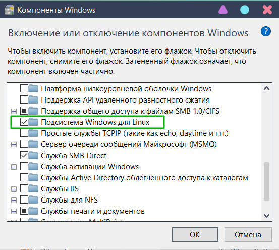
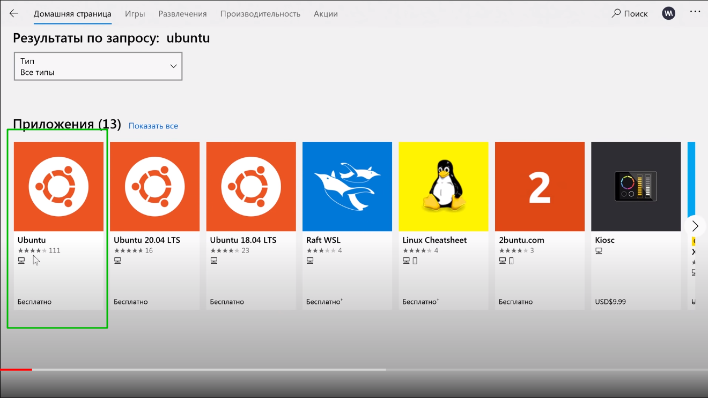
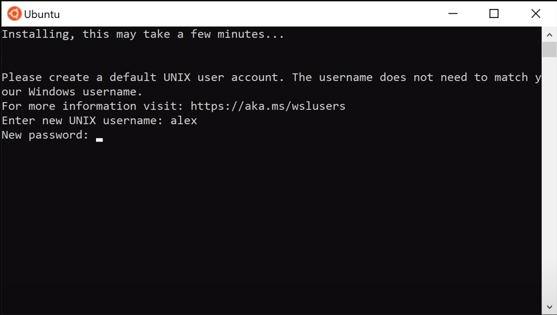
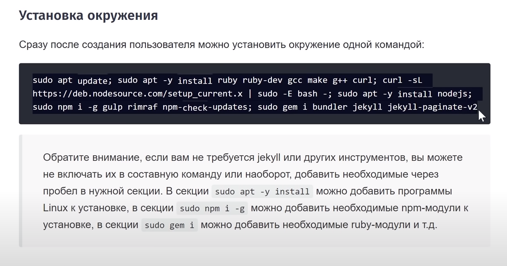
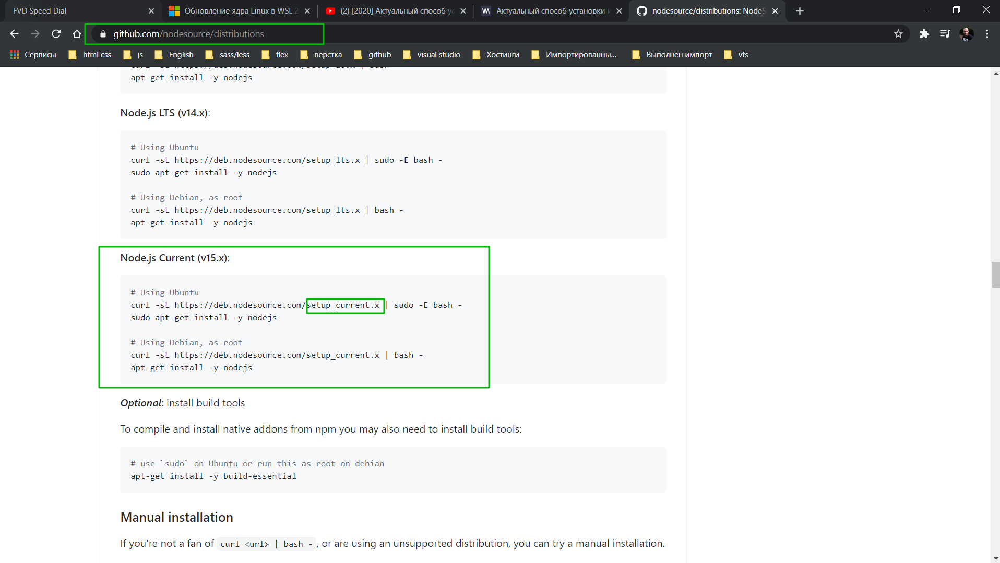
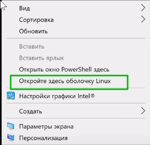
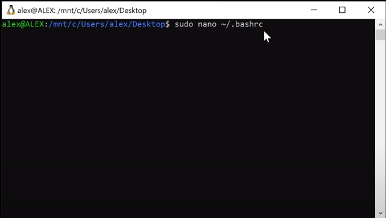
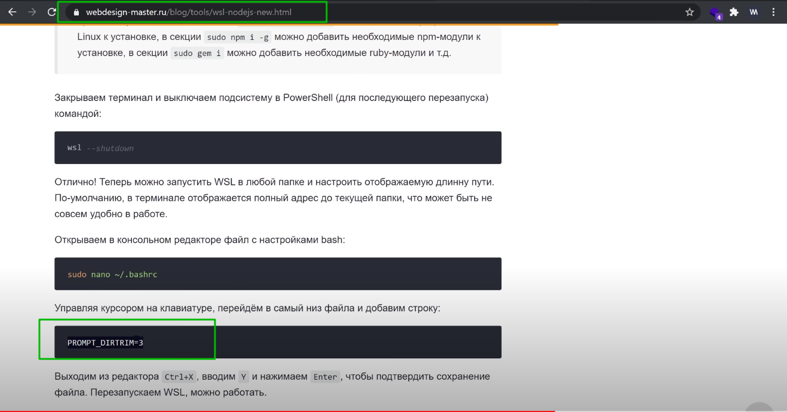
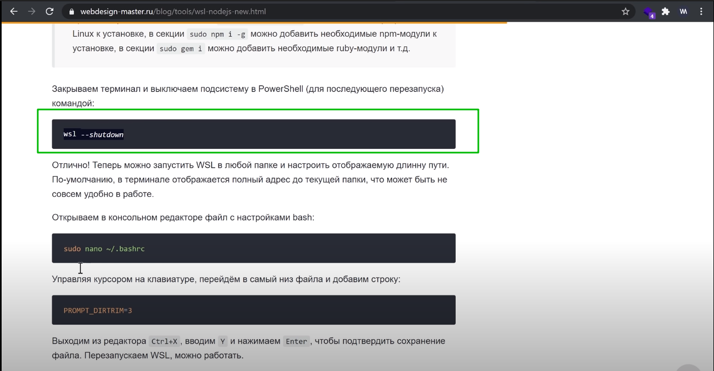
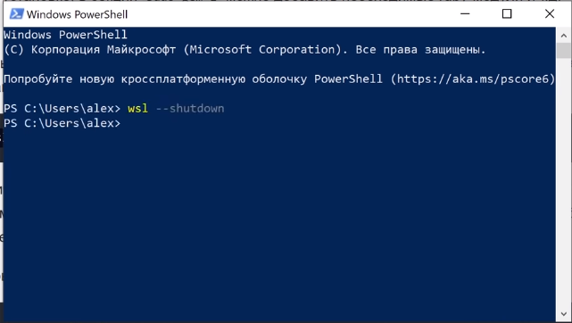

# установки и настройки окружения Windows WSL

[https://www.youtube.com/watch?v=HYuFw-YldjU](https://www.youtube.com/watch?v=HYuFw-YldjU)

Способ установки обновился. Если до этого была установлена Ubuntu находим ее в списке программ и удаляем.

Если вы устанавливаете подсистему впервые. Для начало необходимо активировать возможность использования подсистемы. Для этого захожу в Панель задач или в терминале вбиваю

```shell
control.panel
```

Перехожу в раздел **Программы и компоненты - Включение или отключение компонентов windows**



Включаю подсистему **Windows** для **Linux**. После чего перезагружаю компьютер. После чего перехожу в магазин **windows** и устанавливаю не номерную версию, самую последнюю.



Далее указваю имя пользователя и указываю пароль.



Обратите внимание что когда вы вводите пароль его здесь не видно.

Теперь можно перейти к настройке окружения.

[https://webdesign-master.ru/blog/tools/wsl-nodejs-new.html](https://webdesign-master.ru/blog/tools/wsl-nodejs-new.html)



через **sudo apt update;** мы обновляем менеджер пакетов
**ruby-dev gcc make g++** необходимы для корректной установки и работы **jekyll**(вроде так).
curl необходим для установки **NodeJS** из репозитория **Node source.**
**curl -sL https://deb.nodesource.com/setup_14.x | sudo -E bash -;** мы получаем текущую версию **NodeJS**.

У него в команде **setup_current.x** а у **меня setup_14.x**. обратите внимание что вы можете установить версию **LTS**. Вместо **setup_current** вы можете подставить наприер



Т.е. как у меня стоит **setup_14.x**. Но команда **setup_current.x** устанавливает текущую версию. Так что лучше использовать ее.

После чего мы устанавливаем **sudo npm i -g gulp rimraf npm-check-updates;** это дополнительные необходимые модули.

Ну и в последней секции мы устанавливаем необходимые плагины. **sudo gem i bundler jekyll jekyll-paginate-v2**. Обратите внимание что если вам **jekyll** не требуется то вы можете его не писать. Или наоборот если вам требуется что то установить дополнительно то через пробел вы можете указать в нужную секцию.

Например в секции sudo **apt -y** у нас устанавливаются программы **linux**.

В секции **sudo npm i -g** у нас устанавливаются необходимые npm модули.

И в секции **sudo gem i** устанавливаются необходимые **ruby** модули.

После установки окружения можно запустить систему в любой папке. Например я запущу на рабочем столе. Зажимаю **Shift + правая кнопка мыши.**



Настройка отображаемой длинны пути. По умолчанию в терминале отображается полный адрес до текущей папки что может быть не совсем удобно в работе.

Откроем в консольном редакторе файл с настройками **bash**



Переходим в самый конец документа.

Данную строчку настройки находим здесь.



Нажимаем **Ctrl + X + Y** и **Enter**.

Далее нужно запустить систему в **Powerhell**





Конечно все запускаю от имени администратора.

Данные настройки необходимы для корректности работы. Если вы сразу начнете работать то скорее всего вы получите ошибки в процессе работы.

Так же в совокупности смотри вот эту настройку [https://docs.microsoft.com/ru-ru/windows/wsl/install-win10](https://docs.microsoft.com/ru-ru/windows/wsl/install-win10)
