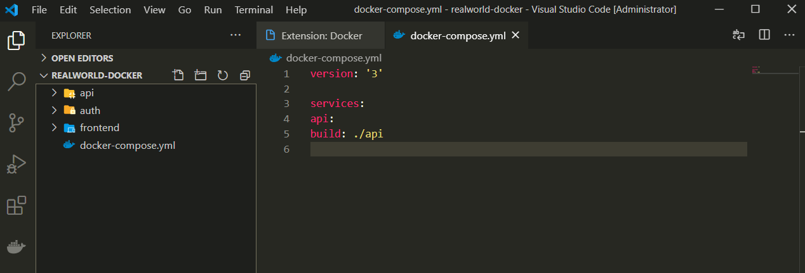
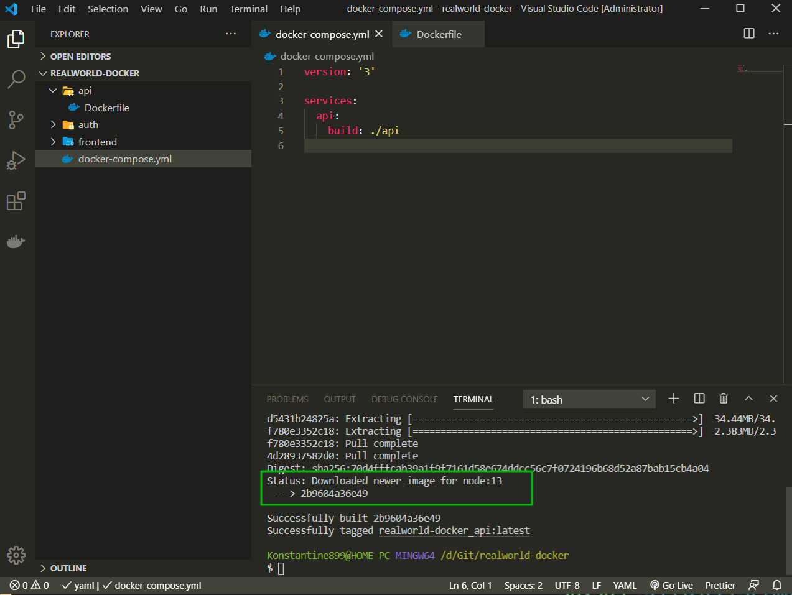
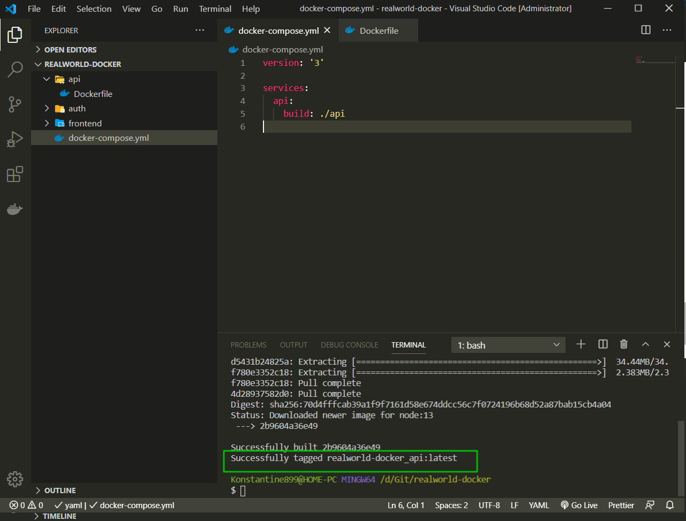
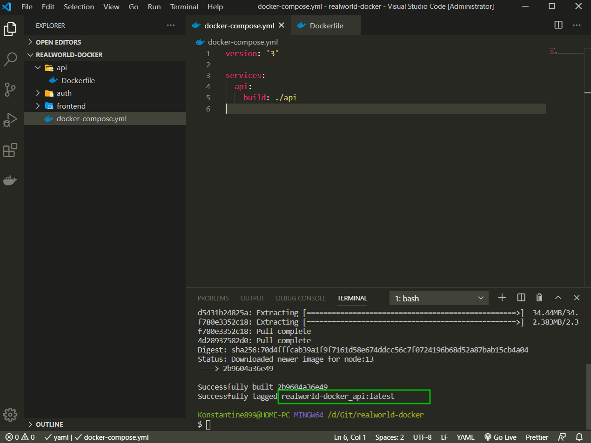

# Создание Dockerfile

Создаю папку **realworld-docker**. Далее в ней создаю файл **docker-compose.yml** и это именно файл в котором мы будем писать нашу конфигурацию.

Первое что я указываю в конфигурационном файле это версию **docker** которую я буду использовать.

```yml
version: '3'
```

Далее я пишу **services:** это как раз те сервисы о которых я говорил т.е. это сервисы для **front-end**, **back-end**, **БД**, **Mailer** и т.д.

Для начало создадим всего лишь один сервис для нашего **api:** который не содержит данных **user** т.е. где у нас просто наши сущности и назовем его **api**.

И теперь добавим один единственный ключ **build: ./api**

```yml
version: '3'

services:
  api:
    build: ./api
```

Это значит что здесь мы создаем все сервисы, описываем, которые **docker-compose** должен **build** и запустить. И первый сервис который мы создали это **api**. И вот это папочка **build: ./api** и путь к ней указывает что **Docker-compose** должен взять **dockerfile** из папки **api**.

Что же токое **Dockerfile**?

Заходим на официальную документацию.

[https://docs.docker.com/engine/reference/builder/](https://docs.docker.com/engine/reference/builder/)

Для того что бы **Docker** мог создавать образы, нам необходимо создать **Dockerfile**. В **Dockerfile** описано как жы мы вообще будем билдить наш образ.

В корне проекта создаю папку **api**. И по факту для каждого сервиса мы будем создавать отдельную папку.



Ну и в принципе пока хватит.

Захожу в папку **api** и в ней создаю новый файл **Dockerfile**. Его название идет с большой буквы.
И в нем пишем как мы хотим создавать образ для нашего **api**.

Возникает вопрос. А что же токое образ?

Если я в поисковике вобъю **Docker image** я получу информацию что же такое образ.
[https://docs.docker.com/engine/reference/commandline/images/](https://docs.docker.com/engine/reference/commandline/images/). Т.е. **Docker image** это вообще образ **Linux**.

В **Dockerfile** пишу **FROM node:13**.

```yml
# Dockerfile
FROM node:13
```

т.е это значит что мы хотим создать наш образ для **api** используя образ **node: 13**. Который уже был ранее кем-то создан.

Теперь через терминал захожу в проект и пишу команду

```shell
docker-compose build
```

Здесь четко написано что происходит, в консоли. После того как образ скачается он будет доступен нам локально.

Зависимости мы скачиваем однажды и после их можем переиспользовать.



Это значит что мы скачали образ с node внутри. Это значит что у нас есть образ **linux** в который уже было кем-то установлено **node:13**.



Это значит что мы смогди создать свой ораз с **api** используя скаченный образ.
т.е. в одну команду **FROM node:13** в нашем **Dockerfile** наш **Docker-compose** смог создать нам наш собственный образ.

Для нас **Docker-compose** уже назвал этот образ



т.е. это наш образ который лежит локально. Он не доступен никому другому и он был создан из **node:13**.

А теперь обратите внимание все что мы написали

```yml
# Dockerfile
FROM node:13
```

```yml
# docker-compose.yml
version: '3'

services:
  api:
    build: ./api
```

Описали просто папку где сервису **api** брать **Dockerfile**.

Все остальное **Docker-compose** сделал за нас. Мы не увидили ни одну команду **Docker** напрямую. Мы их в принципе не увидим и в будущем. Еслественно мы будем использовать некоторые **Docker** команды поскольку от этого никуда не деться, но тем не менее **docker-compose** очень сильно облегчает нам жизнь. И так с помощью команды **docker-compose build** я смог создать свой первый образ для **api**.
