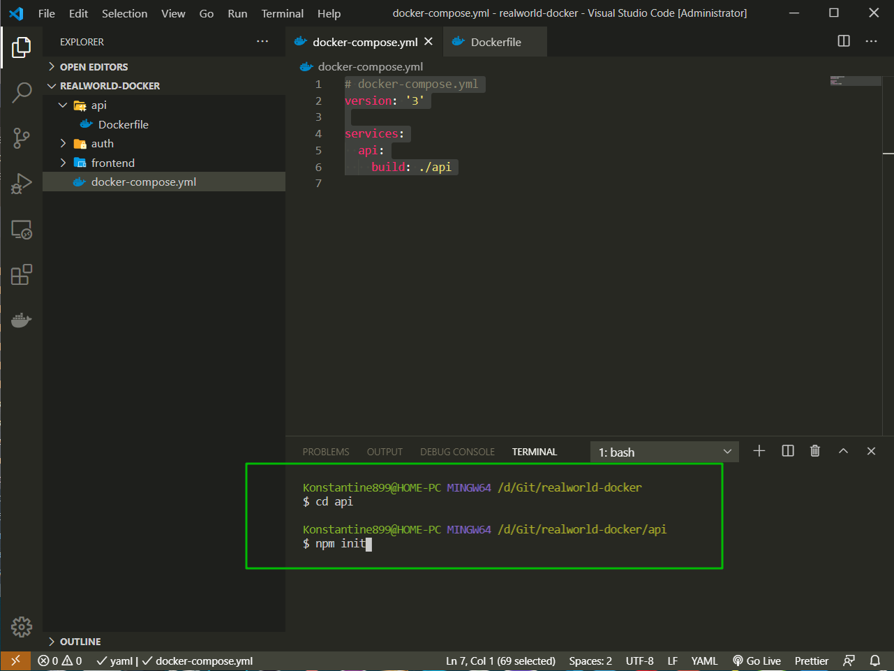
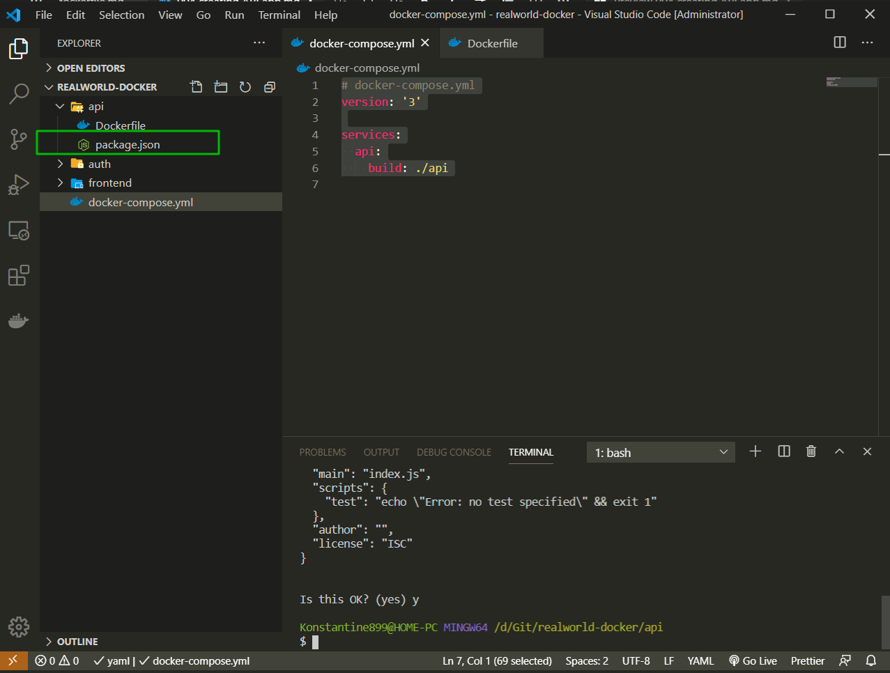
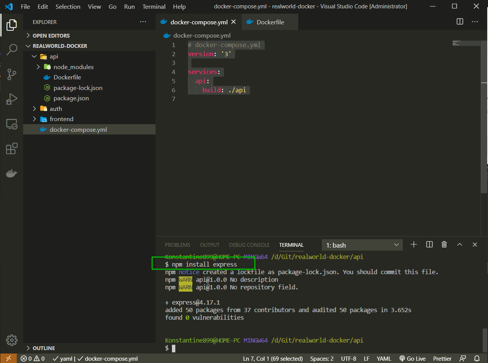
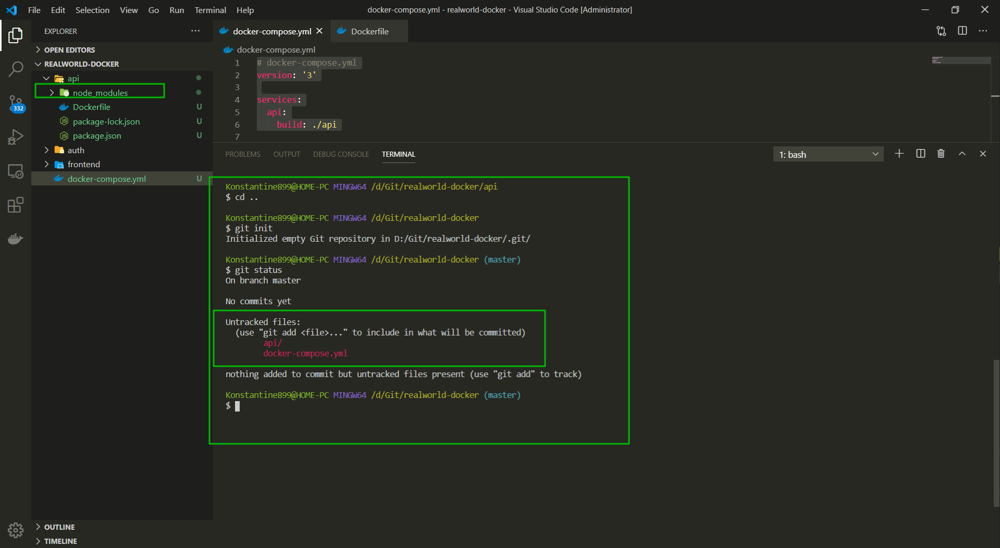
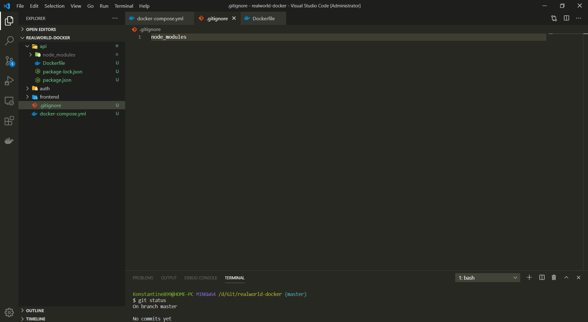
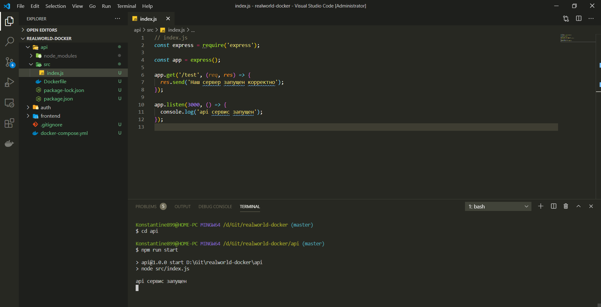
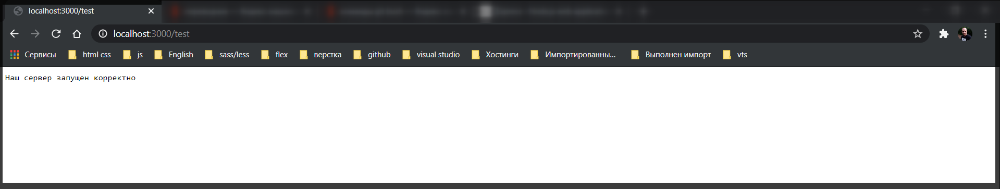

# Создание API для приложения.

Создаем заготовку проекта. Так как у нас там будет **NodeJS** с **Express** то давайте в папке **api** сейчас создадим этот новый проект. Для этого заходим в папку **api**. И в ней запускаю

```shell
npm init
```





В данном **package.json** пока ничего нет. Но мы уже можем устанавливать пакеты.



Вы можете почитать про **express**.

[https://expressjs.com/](https://expressjs.com/)

И теперь я сразу хочу добавить в **.gitignore** папку **node_modules**.

~~C помощью команды **gs** перехожу в корневую дирректорию проекта и инициализирую **git**~~. У меня данная команда не работает в **git bush**. Пробую **cd -** — Вернуться назад или **cd ..** — Выйти на 1 уровень вверх.

Подсказка по камандам [https://rightblog.ru/3274](https://rightblog.ru/3274)



Проблема в том что когда мы установили всего лишь один пакет. У нас сразу установилось миллион пакетов в папку **node_modules**. Это все зависимости пакета **express**. Мы хотим добавить в **.gitignore** папку **node_modules** со всех проектов.



Теперь в папке **api** создаю папку **src**. Это будет та папка в которой будут все рабочие файлы проекта и в нутри ее создаю **index.js**.

Подключаю **express**. Т.е. достаю express из папки **node_modules**

```js
// index.js
const express = require('express');
```

Далее создаю наше новое приложение просто вызвав **express** с круглыми скобками.

```js
// index.js
const express = require('express');

const app = express();
```

Теперь на app я могу вешать роуты. Так как у нас тестовое приложение я создаю роут **/test** и когда мы будем вызывать этот роут в браузере мы будим видеть что наш вэб сервер работает.

```js
// index.js
const express = require('express');

const app = express();

app.get('/test', (req, res) => {});
```

Как второй аргумент мы здесь имеет **callback** в который приходит **req**,**res**.

```js
// index.js
const express = require('express');

const app = express();

app.get('/test', (req, res) => {
  res.send('Наш сервер запущен корректно');
});
```

Теперь нам осталось запустить наш **app** сервер.
Для этого я пишу **app.listen**, первым аргументом вызываю порт на котором будет производиться запуск приложения **3000**. Вторым аргументом принимаю **callback** т.е. мы хотим при удачном запуске сервера написать в консоль

```js
// index.js
const express = require('express');

const app = express();

app.get('/test', (req, res) => {
  res.send('Наш сервер запущен корректно');
});

app.listen(3000, () => {
  console.log('api сервис запущен');
});
```

В **package.json** создаю новую команду для запуска приложения
**"start": "node src/index.js"**

```json
{
  "name": "api",
  "version": "1.0.0",
  "description": "",
  "main": "index.js",
  "scripts": {
    "start": "node src/index.js"
  },
  "author": "",
  "license": "ISC",
  "dependencies": {
    "express": "^4.17.1"
  }
}
```

Если я пишу **start** то это скрипт для **production**. А **dev** это скрипт для **development**.

Захожу в папку **api** и запускаю скрипт.





Мы запустили сервер с локальной машины просто потестить работоспособность.
Далее мы будем мигрировать наш сервис внутрь **Docker**.
