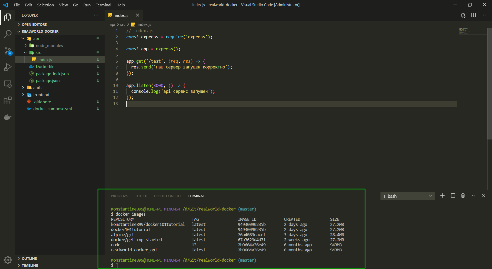
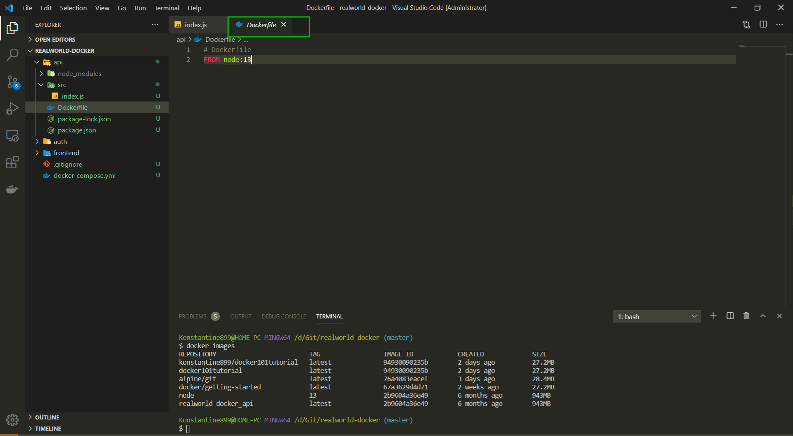
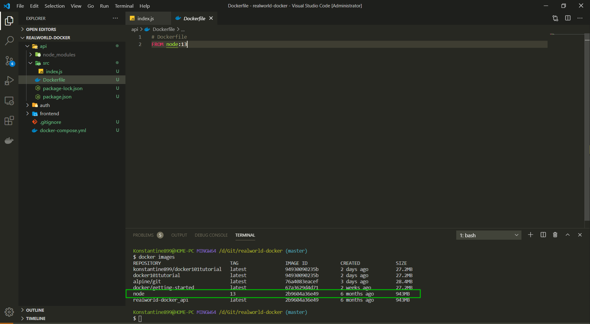
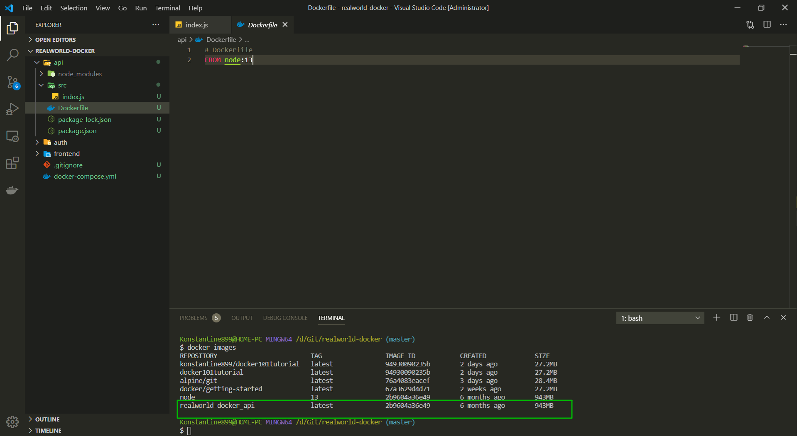
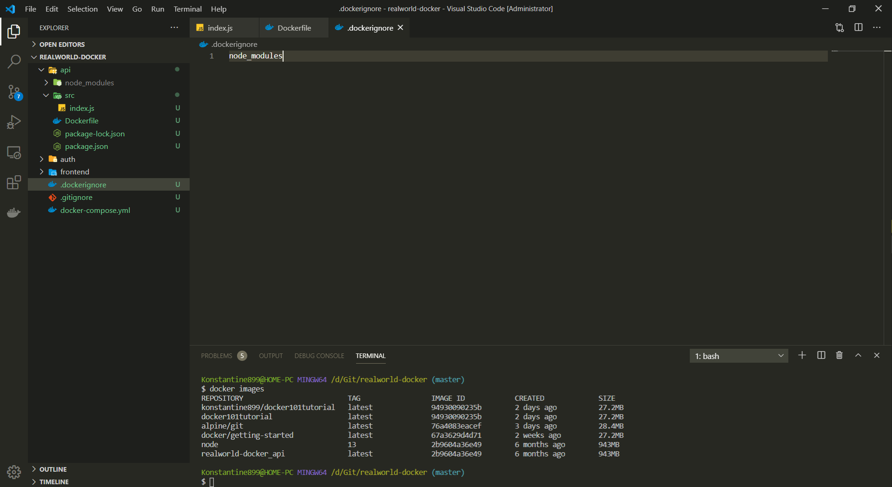
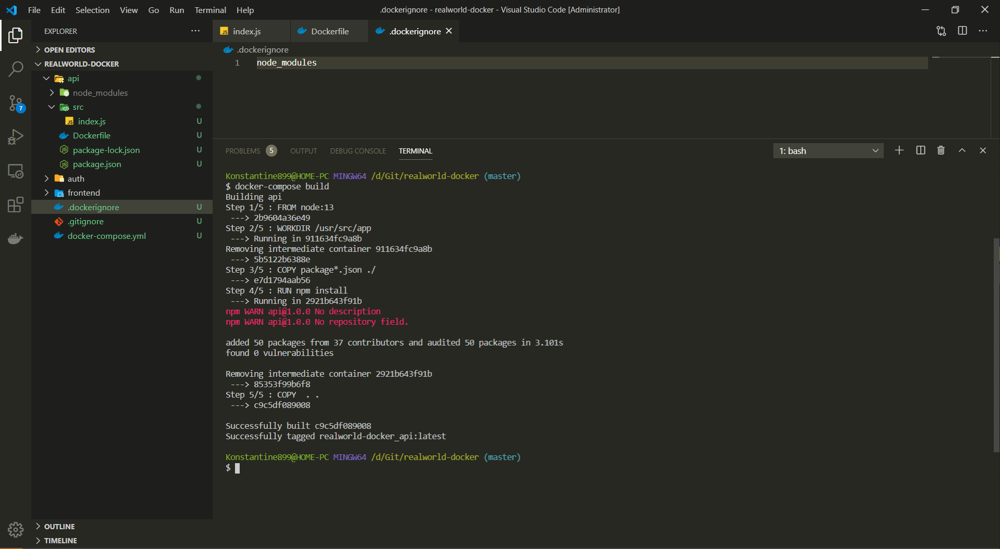
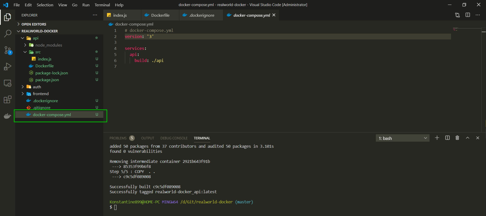

# Подготовка API Docker образа

Теперь я бы хотел показать класную команду из **Docker**

```shell
docker images
```



Это список всех образов которые есть на нашей машине.

Нас интересуют две вещи.

1. Давайте найдем **Docker image** который мы использовали в **Dockerfile**



Т.е. Здесь была **FROM node:13**. Находим ее среди созданных образов.



Если я хочу сделать поиск по ключевому слову то в консоли прописываю

```shell
docker images | grep node
```

Так же мы можем посмотреть **image** который мы с вами создали



Это именно тот образ который мы создали с **image** т.е. **FROM node:13**.

Теперь что мы делаем дальше? А дальше мы указываем нашу рабочую дирректорию для этого я пишу команду **WORKDIR /usr/src/app**. Для лучшего понимания лучше указывать **/usr/**. Можно указывать просто **src/app** и это так же будет работать. И в принципе это вообще не вожно поскольку у нас есть наш образ из которого создастся контейнер. И внутри этого контейнера мы просто создаем дополнительную папку **app** в которой мы будем работать. Т.к. у нас приложение полностью изолировано, нам абсолютно не важно то как мы назовем папку. Но лучше следовать правилам.

```Dockerfile
# Dockerfile
FROM node:13

WORKDIR /usr/src/app
```

Следующий шаг это скопировать наш **package.json** и **package-lock.json** внутрь контейнера. Как вы видите все файлы в папке **api** сейчас находятся на нашей локальной машине. Естественно это не то как мы это планируем. Наша задача поместить все файлы внутрь **Docker** контейнер.

Для этого мы будем использовать команду copy и в начале я буду ипользовать только эти два файла **package.json** и **package-lock.json**. **package-lock.json** - это очень важный файл, это слепок с **package.json** который точно указывает все версии и их зависимости. Это очень важный файл и его обязательно нужно копировать.

```Dockerfile
# Dockerfile
FROM node:13

WORKDIR /usr/src/app

COPY package*.json ./
```

**COPY package\*.json ./** что это значит? Это значит что в нашу рабочую директория **./** а точнее папку **app** попадают все файлы с начальным названием **package**. Т.е. эти два файла просто скопируются внутрь **Docker** контейнер когда мы его создадим.

2. Следующий шаг это установить все npm пакеты. Для выполнения всяких команд которые мы привыкли выполнять в консоли есть команда **RUN**.

```Dockerfile
# Dockerfile
FROM node:13

WORKDIR /usr/src/app

COPY package*.json ./

RUN npm install
```

И это значит что после того как **Docker** скопирует файлы **COPY package\*.json ./** он запустит npm **install** внутри нашего контейнера потому что мы не хотим иметь снаружи на нашей машине **node_modules**, они должны быть изолированы только внутри контейнера.

И последним шагом будет **COPY . .**

```Dockerfile
# Dockerfile
FROM node:13

WORKDIR /usr/src/app

COPY package*.json ./

RUN npm install

COPY  . .
```

Это значит что мы хотим что бы все файлы которые здесь лежатскопировать внутрь нашего контейнера. Не вольным образом создается вопрос почему это **COPY . .** не сделать выше, вот здесь **COPY package\*.json ./**. Дело в том что мы хотим установить **node_modules** внутри **Docker** контейнера.

Его объяснения это полный треш!!!

Кароче с помощью этой команды **COPY . .** копируются все файлы. Для того что бы этого избежать на локальной машине, точно так же как и **.gitignore** создаю файл в корне **.dockerignore** и вписываю **node_modules**.



Т.е. мы сначало копируем **COPY package\*.json ./** после чего запускаем **RUN npm install** что бы установить пакеты внутри нашего образа. И дальше копируем все файлы проекта **COPY . .**

И так этих команд достаточно что бы сбилдит наш **image**.

Пишу в консоли.

```shell
docker-compose build
```

Запускаю эту команду находясь в корне проекта.



Если мы посмотрим в **docker-compose.yml** то там практически ничего нет.

```yml
# docker-compose.yml
version: '3'

services:
  api:
    build: ./api
```



Здесь просто указываюеся сбилди нам сервис **api т.е. build: ./api** и внутри сервиса мы описываем как мы собираем проект.

```Dockerfile
# Dockerfile
FROM node:13

WORKDIR /usr/src/app

COPY package*.json ./

RUN npm install

COPY  . .
```

О том что каждый сервис должен знать о том как себя билдить, собирать.

А в **Docker-compose** мы можем уже можем использовать всякие параметры. Переменные окружения и т.д.

И так наш образ для **api** полностью готов поскольку мы скопировали внутрь **src** т.е. наш сервер который мы написали. Установили внутри **node_modules** и можем дальше продолжать разработку.
