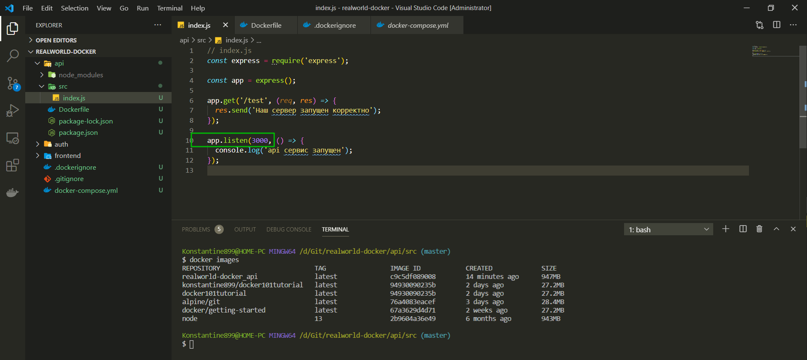
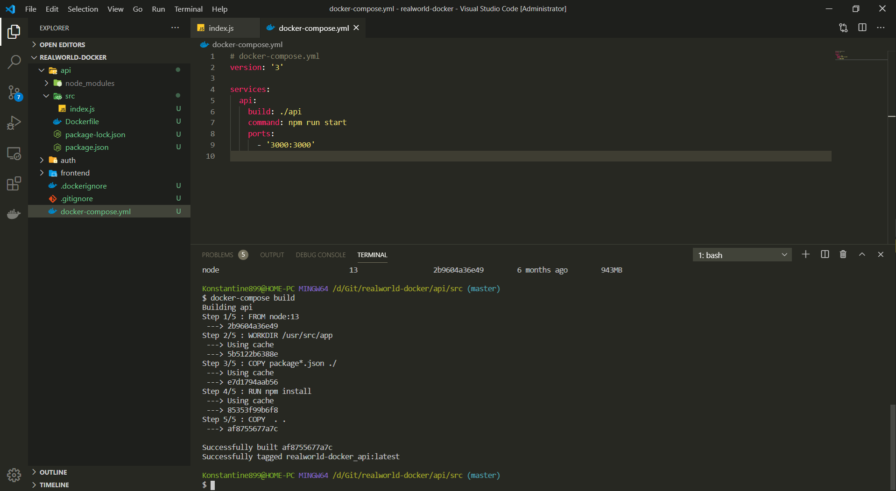
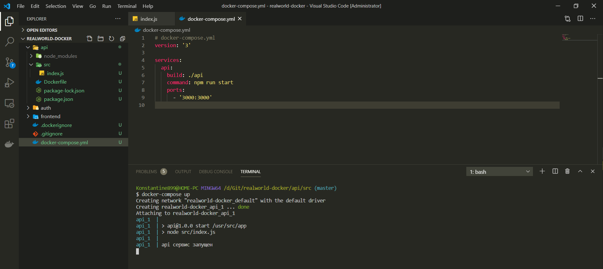
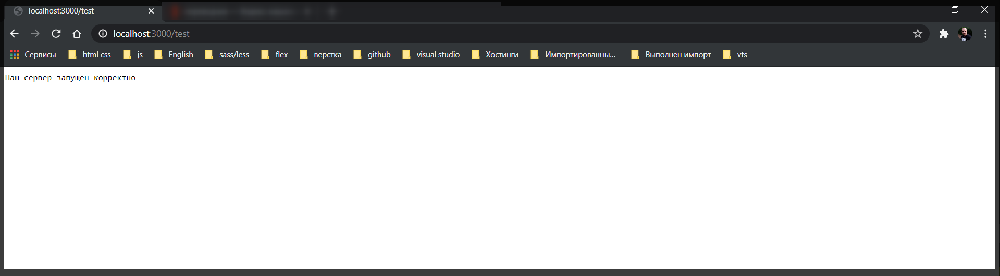

# Запуск API сервера

Запускаем наш **web-server** внутри **docker**. Для этого обычно в **Dockerfile** мы пишем **EXPOSE** порт запуска **3000**. После чего прописываю команду **CMD** и в массиве прописываю **["node", "run start"]**.

```Dockerfile
# Dockerfile
FROM node:13

WORKDIR /usr/src/app

COPY package*.json ./

RUN npm install

COPY  . .

EXPOSE 3000

CMD ["node", "run start"]
```

**EXPOSE 3000** это тот порт который мы хотим раскрыть из **docker** контейнера для внешнего мира. В нашем случае мы запускаем контейнер на нашей машине т.е. для того что бы мы могли зайти по **localhost:3000** с нашей локальной машины мы должны заэкспоузить порт из нашего контейнера. Т.е. этот порт который мы указали при запуске приложения.



**CMD ["node", "run start"]** - это команда для того что бы запустить наш **web-server**. Это тоже самое что мы писали в консоли **npm run start**.

Но мы не будем эти две команды **EXPOSE 3000** и **CMD ["node", "run start"]** писать здесь. Потому что я хочу такие вещи как **port** и какие команды мы запускаем, все писать на уровне **docker-compose**.

Оставляю файл таким.

```Dockerfile
# Dockerfile
FROM node:13

WORKDIR /usr/src/app

COPY package*.json ./

RUN npm install

COPY  . .
```

Когда мы описываем код ка на примере выше в **Dockerfile** у нас получается что-то вроде **states.service**. Это значит что наш **service** можно конфигурировать по разному, но он в принципе ничего не знает о своих переменных. О каких-то вещах которые мы хотим запускать снаружи.

И мы это все конфигурируем внутри **docker-compose.yml** и потом мы будем подменять этот **docker-compose.yml** выполняя разные команды для разработки локально и для **production**.

И так нам сейчас необходимо для нашего **api** написать две новые команды **comand:** и это будет команда которая выполнится при старте нашего сервиса **npm run start**.

Следующая команда это **ports:** здесь я указываю какие порты будут доступны снаружи **- "3000:3000"**. Здесь **- "3000:3000"** указано что мы хотим снаружи открыть порт **3000**.

Почему **3000** справа и слева? Слева это у нас **host** т.е. снаружи т.е. это наша машина. Справа это у нас порт контейнера

```yml
# docker-compose.yml
version: '3'

services:
  api:
    build: ./api
    command: npm run start
    ports:
      - '3000:3000'
```

Как вы помните у нас в **index.js 3000** порт.

```js
// index.js
const express = require('express');

const app = express();

app.get('/test', (req, res) => {
  res.send('Наш сервер запущен корректно');
});

app.listen(3000, () => {
  console.log('api сервис запущен');
});
```

Если мы справа напишем 5000 или какой-то другой порт то оно не будет работать. Потому что такой порт не используется внутри нашего **api** контейнера. Поэтому справа 100% 3000.

Слева может быть абсолютно любой порт. Поскольку это порт нашей машины. И это просто порт по которому оно будет доступно и будет ссылаться на нег из нашего **docker** контейнера. Но для простоты обычно используют тот же самый **port** что и внутри что бы избежать путаницы. Поэтому эта команда просто открывает порт **3000** для нашего **host**.

Теперь попробуем еще раз сбилдить наш **image**. Для этого напишем

```shell
docker-compose build
```



Теперь вопрос в том как же нам запустить **docker-compose**? Для этого есть команда

```shell
docker-compose up
```

Если сборка приложения прошла успешно, то запуск приложения однозначно будет успешным.



Теперь если в браузере зайду на наш роут.



Теперь если я в консоли нажму **Ctrl + C** тем самым я остановлю нашу команду **docker-compose up**
