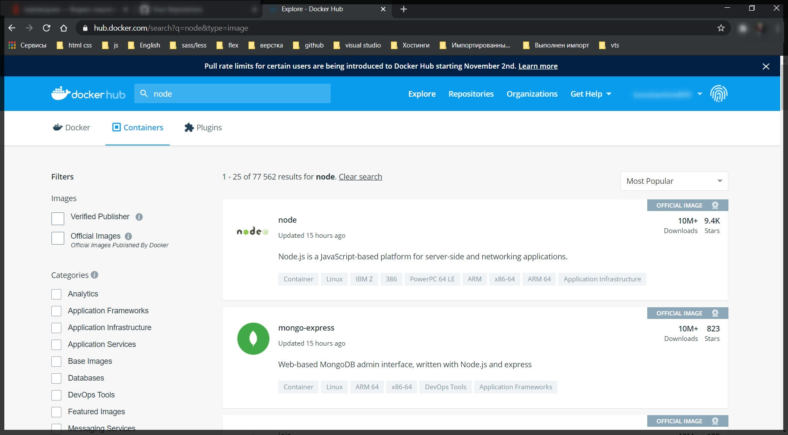
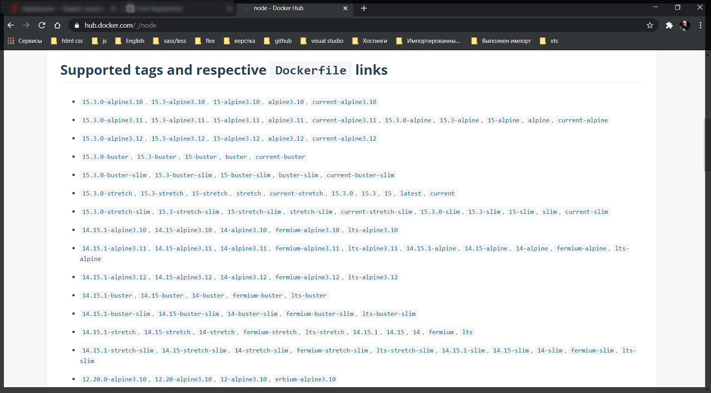
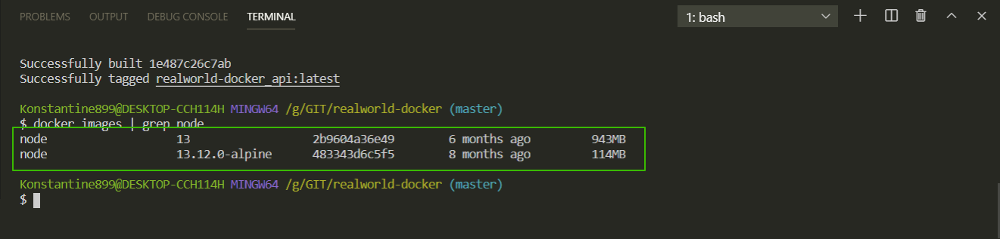

# Docker Hub

И так когда я в **Dockerfile** написал **FROM node:13** это каким-то магическим образом скачало сам образ этого **node**.

Если я перейду [https://hub.docker.com/](https://hub.docker.com/). На данном сайте я могу скачать разные образы **Docker**. Люди могут запушить сюда свои образы или скачать существующие.

Если в поиске я вобъю **node** то выведется список отсортированный по популярности.



Лучше всего скачивать официальные образы т.е. **OFFICIAL IMAGE**.

Если зайти на любой из официальных образов то можно посмотреть документацию. Что такое **NodeJS**, как использовать этот **image** и т.д.

Так же очень важная часть это теги



Т.е. допустим FROM node:13 это тоже тег.

Так же если посмотрю размер образов

```shell
docker images | grep node
```

У нас наш образ занимает почти один гигабайт. Это очень много и есть вариант сделать этот образ меньше.

Существует такая штука как **docker-alpine** [https://github.com/gliderlabs/docker-alpine](https://github.com/gliderlabs/docker-alpine). Это специальная версия образа т.е. специальная версия **Alpine Linux**.

Изменяю **Dockerfile** дописываю **FROM node:13.12.0-alpine**

```Dockerfile
# Dockerfile
FROM node:13.12.0-alpine

WORKDIR /usr/src/app

COPY package*.json ./

RUN npm install

COPY  . .
```

Всегда в **FROM** указывай точные версии, а то поломка необратима.

Теперь пересобираю проект.

```shell
docker-compose build
```

И далее смотрю размер образов

```shell
docker images | grep node
```


