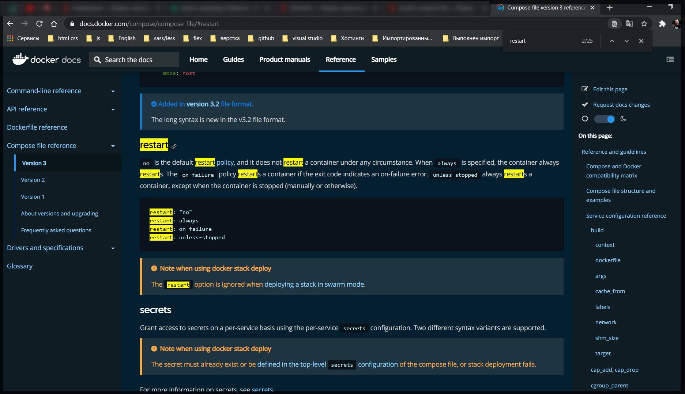
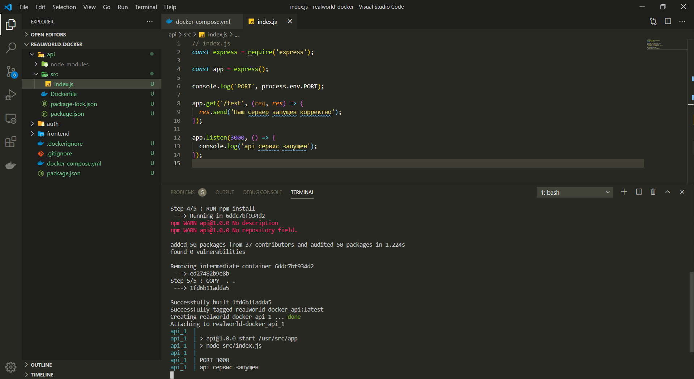
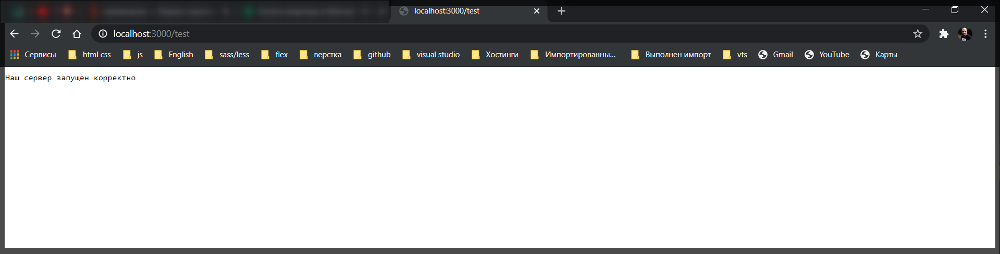
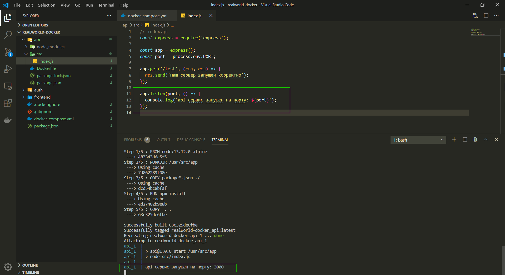
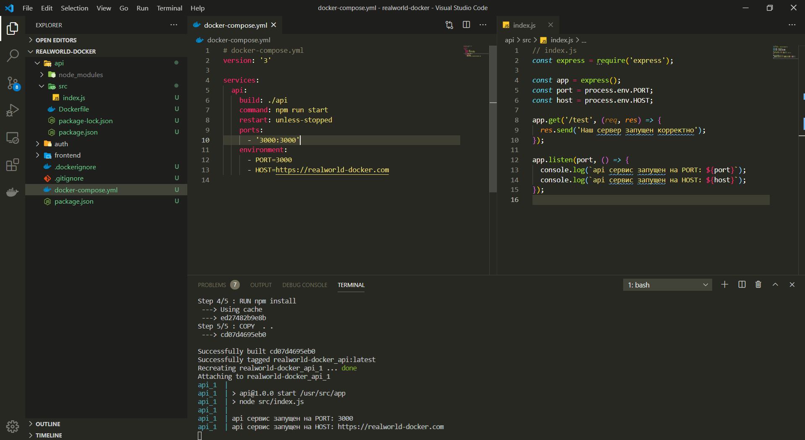

# Переменные окружения

В разных условиях мы хотим использовать разные переменные. Например для **production** мы хотим использовать одну команду, а для разработки локально другую. Либо например локально у нас один порт, на **production** другой порт и т.д.

Для начало давайте в наш файл **docker-compose.yml** добавим еще одно поле **restart: unless-stopped**

```yml
# docker-compose.yml
version: '3'

services:
  api:
    build: ./api
    command: npm run start
    restart: unless-stopped
    ports:
      - '3000:3000'
```

это команда которая говорит о том что если вдруг наш контейнер упал т.е. наш веб-сервер остановился или произошла какая-то ошибка, то **docker-compose** попробует заново запустить наш контейнер.
Данную команду я узнал из [https://docs.docker.com/compose/compose-file/](https://docs.docker.com/compose/compose-file/). На данном сайте в поисковике вбиваю restart и тут я могу почитать [https://docs.docker.com/compose/compose-file/#restart](https://docs.docker.com/compose/compose-file/#restart).



restart: **unless-stopped** самый популярный вид **restart**.

Для того что бы почитать на этом сайте в поисковие вбиваю **compose-file** и потом на сайте ищу интересующие меня настройки.

И так к переменным окружения. мы хотим указать разный порт или разный **host** в нашем **services: api:**

После портов указываю **enviroment:** и далее указываю переменные. Напримет **-PORT=3000**

```yml
# docker-compose.yml
version: '3'

services:
  api:
    build: ./api
    command: npm run start
    restart: unless-stopped
    ports:
      - '3000:3000'
    environment:
      - PORT=3000
```

Это значит что мы указали новую переменную окружения.

Теперь если я зайду в **api/src/index.js** то здесь я могу узнать из процесса узнать переменную порта. Выведу в консоль **console.log('PORT', process.env.PORT);**

```js
// index.js
const express = require('express');

const app = express();

console.log('PORT', process.env.PORT);

app.get('/test', (req, res) => {
  res.send('Наш сервер запущен корректно');
});

app.listen(3000, () => {
  console.log('api сервис запущен');
});
```

собираю и запускаю проект

```shell
docker-compose up --build
```



Все сработало и я в консоли вижу **PORT 3000**.

В index.js я могу создать переменную и писвоить второй аргумент который я указывал при выводе в консоль. И дальше слушать эту переменную а не конкретный порт как я писал выше.

```js
// index.js
const express = require('express');

const app = express();
const port = process.env.PORT;

app.get('/test', (req, res) => {
  res.send('Наш сервер запущен корректно');
});

app.listen(port, () => {
  console.log('api сервис запущен');
});
```

Обычно я все такие переменные кладу в отдельный файл конфигурации.

Теперь я всегда должен указывать порт снаружи для запуска приложения.

Пересобираю проект.

```shell
docker-compose up --build
```



Обычно я указываю на каком порту запустилось приложение.

```js
// index.js
const express = require('express');

const app = express();
const port = process.env.PORT;

app.get('/test', (req, res) => {
  res.send('Наш сервер запущен корректно');
});

app.listen(port, () => {
  console.log(`api сервис запущен на порту: ${port}`);
});
```



Так же внутрь я могу передать **HOST** если мы говорим о том что у нас разные переменные окружения для **production** и **development**.

```yml
# docker-compose.yml
version: '3'

services:
  api:
    build: ./api
    command: npm run start
    restart: unless-stopped
    ports:
      - '3000:3000'
    environment:
      - PORT=3000
      - HOST=https://realworld-docker.com
```

```js
// index.js
const express = require('express');

const app = express();
const port = process.env.PORT;
const host = process.env.HOST;

app.get('/test', (req, res) => {
  res.send('Наш сервер запущен корректно');
});

app.listen(port, () => {
  console.log(`api сервис запущен на PORT: ${port}`);
  console.log(`api сервис запущен на HOST: ${host}`);
});
```



Это так же удобно делать при отправле писем пользователя. Соответственно я хочу тестовый токен для **development** и для **production** реальный **token** за который будут браться деньги. Соответственно это тоже удобно делать через переменные окружения.
