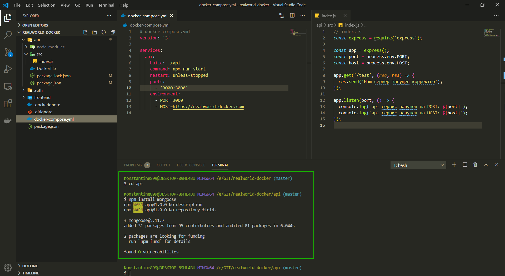
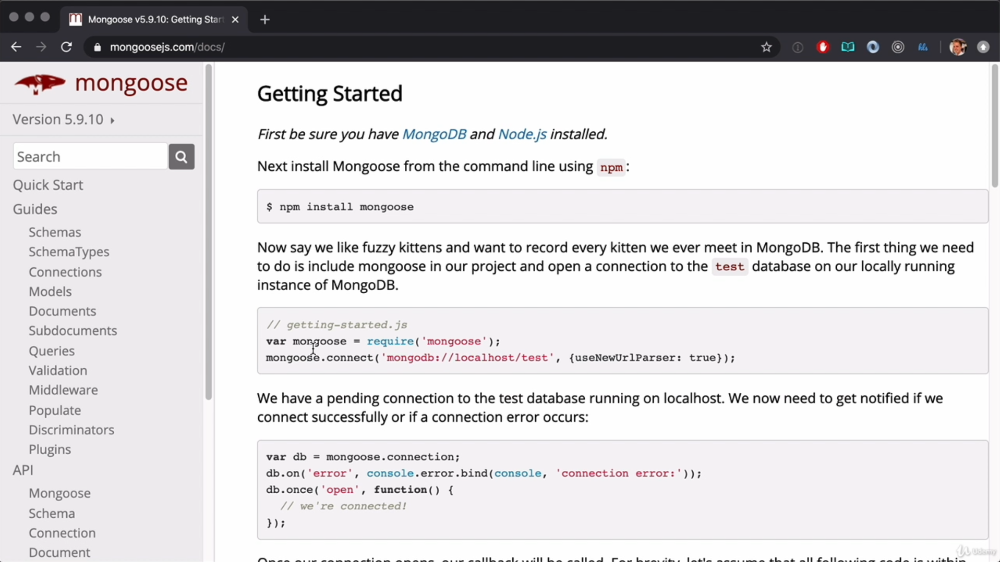
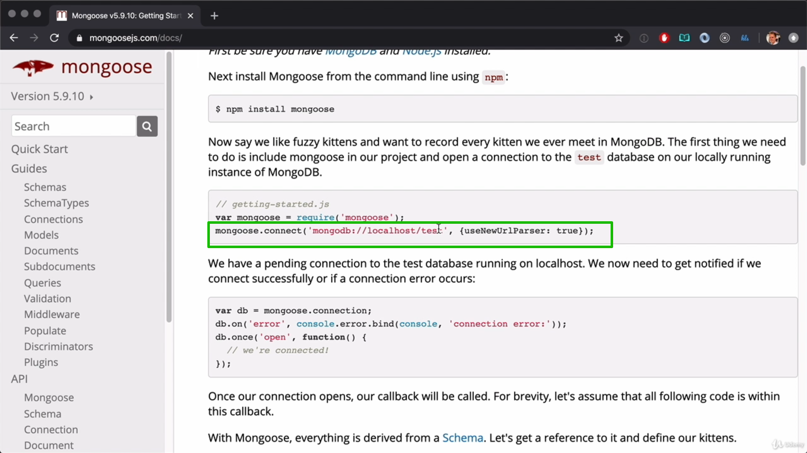
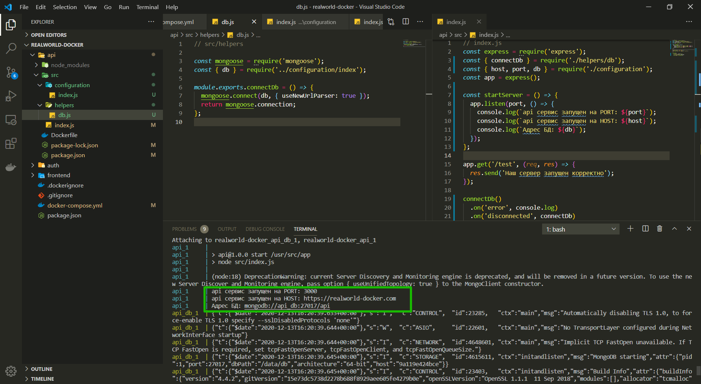

# Добавление БД

Перехожу в каталог **api**

```shell
cd api
```

И там устанавливаю

```shell
npm install mongoose
```



[http://mongoosejs.com/docs/](http://mongoosejs.com/docs/)



В данной документации описано как взаимодействовать с **mongoose**.

Однако мы не знаем что стартанет раньше, коннект к БД или наш веб сервер. Как этого избежать? Сначало нужно подключится к БД а после все остальное.

Для этого в папке src я создаю новую папку **helpers** и в ней создаю **db.js**. Это будет наш вспомогательный файл для обращения и подключения к БД.

```js
// src/helpers

const mongoose = require('mongoose');
```

Далее создаю и сразу экспортирую функцию **connectDB** она будет отвечать за то что подключает нас к BD

```js
// src/helpers

const mongoose = require('mongoose');

module.exports.connectDB = () => {
  mongoose.connect(db);
};
```

db это вот эта вот строка, но я ее создам позже.



И вторым аргументом указываю опции указанные в документации.

```js
// src/helpers

const mongoose = require('mongoose');

module.exports.connectDB = () => {
  mongoose.connect(db, { useNewUrlParser: true });
};
```

Далее мне необходимо вернуть данное подключение

```js
// src/helpers

const mongoose = require('mongoose');
const { db } = require('../configuration/index');

module.exports.connectDb = () => {
  mongoose.connect(db, { useNewUrlParser: true });
  return mongoose.connection;
};
```

Теперь данное подключение я могу использовать в файле **index.js**

```js
// index.js
const express = require('express');
const { connectDb } = require('./helpers/db');

const app = express();
const port = process.env.PORT;
const host = process.env.HOST;

app.get('/test', (req, res) => {
  res.send('Наш сервер запущен корректно');
});

app.listen(port, () => {
  console.log(`api сервис запущен на PORT: ${port}`);
  console.log(`api сервис запущен на HOST: ${host}`);
});

connectDb()
  .on('error', console.log) // при не удачном подключении вывожу ошибку в консоль
  .on('disconnected', connectDb) // При отключении снова подключение
  .once('open', startServer); // При удачном подключении запуск callback startServer
```

Далее создаю **startServer** и внутрь перемещаю **app.listen**.
Т.е. запуск приложения будет осуществляться только после того как произойдет подключение к БД.

Ну и конечно что бы все это заработало нужно подключить функцию **connectDB** из **./helpers/db.js**.

```js
// index.js
const express = require('express');
const { connectDb } = require('./helpers/db');

const app = express();
const port = process.env.PORT;
const host = process.env.HOST;

const startServer = () => {
  app.listen(port, () => {
    console.log(`api сервис запущен на PORT: ${port}`);
    console.log(`api сервис запущен на HOST: ${host}`);
  });
};

app.get('/test', (req, res) => {
  res.send('Наш сервер запущен корректно');
});

connectDb()
  .on('error', console.log) // при не удачном подключении вывожу ошибку в консоль
  .on('disconnected', connectDb) // При отключении снова подключение
  .once('open', startServer); // При удачном подключении запуск callback startServer
```

В файле **db.js** мы использовали переменную **db** которую мы не описали.

Я предпочитаю все переменные создавать в дополнительном файле в папке **configuration** и внутри ее **index.js**.

Из главного **index.js** вырезаю

```js
const port = process.env.PORT;
const host = process.env.HOST;
```

И в configuration/index.js прописываю

```js
module.exports.port = process.env.PORT;
module.exports.host = process.env.HOST;

// const port = process.env.PORT;
// const host = process.env.HOST;
```

Для того что бы использовать **db** прописываю все тоже сомое только указываю **MONGO_URL**

```js
module.exports.port = process.env.PORT;
module.exports.host = process.env.HOST;
module.exports.db = process.env.MONGO_URL;

// const port = process.env.PORT;
// const host = process.env.HOST;
```

Соответственно мы нигде не указываем полный путь к нашей БД и мы можем его конфигурировать снаружи. Это именно то что мы хотим поскольку этот путь для **production** и **development** может отличаться.

Теперь подключаю переменные из данного файла

```js
// index.js
// Это правильный файл
const express = require('express');
const { connectDb } = require('./helpers/db');
const { host, port } = require('./configuration');
const app = express();

const startServer = () => {
  app.listen(port, () => {
    console.log(`api сервис запущен на PORT: ${port}`);
    console.log(`api сервис запущен на HOST: ${host}`);
  });
};

app.get('/test', (req, res) => {
  res.send('Наш сервер запущен корректно');
});

connectDb()
  .on('error', console.log)
  .on('disconnected', connectDb)
  .once('open', startServer);
```

```js
// src/helpers

// Это правильный файл

const mongoose = require('mongoose');
const { db } = require('../configuration/index');

module.exports.connectDb = () => {
  mongoose.connect(db, { useNewUrlParser: true });
  return mongoose.connection;
};
```

Если я сейчас запущу **npm run start** то выпадет ошибка т.к. нужно снаружи пропросить путь **module.exports.db = process.env.MONGO_URL;**

Первое что нужно сделать в **docker-compose.yml** это создать **services** который будет в себе хранить БД для **API**.

```yml
# docker-compose.yml
version: '3'

services:
  api:
    build: ./api
    command: npm run start
    restart: unless-stopped
    ports:
      - '3000:3000'
    environment:
      - PORT=3000
      - HOST=https://realworld-docker.com
api_db:
  image: mongo:latest
```

Теперь при сборке скачается последняя версия **mongo** вот она [https://hub.docker.com/\_/mongo](https://hub.docker.com/_/mongo)

В **docker-compose.yml** так же нужно указать какие сервисы нужно запускать первыми. Указывается это в **depends_on:**

```yml
# docker-compose.yml
version: '3'

services:
  api:
    build: ./api
    command: npm run start
    restart: unless-stopped
    ports:
      - '3000:3000'
    environment:
      - PORT=3000
      - HOST=https://realworld-docker.com
    depends_on:
      - api_db
api_db:
  image: mongo:latest
```

Теперь необходимо указать переменную окружения в нашем **API** которую мы создали в нашем проекте **-MONGO_URL=mongodb://api_db:27017/api**

```yml
# docker-compose.yml
version: '3'

services:
  api:
    build: ./api
    command: npm run start
    restart: unless-stopped
    ports:
      - '3000:3000'
    environment:
      - PORT=3000
      - HOST=https://realworld-docker.com
      - MONGO_URL=mongodb://api_db:27017/api
    depends_on:
      - api_db
  api_db:
    image: mongo:latest
```

это **mongodb://api_db:27017/api** разберем в сетях. Это имя **api_db** должно быть такое же как и имя сервиса и тогда этот хост **:27017** будет использован.

И так же я хочу получать ссылку на БД.

```js
// index.js
const express = require('express');
const { connectDb } = require('./helpers/db');
const { host, port, db } = require('./configuration');
const app = express();

const startServer = () => {
  app.listen(port, () => {
    console.log(`api сервис запущен на PORT: ${port}`);
    console.log(`api сервис запущен на HOST: ${host}`);
    console.log(`Адрес БД: ${db}`);
  });
};

app.get('/test', (req, res) => {
  res.send('Наш сервер запущен корректно');
});

connectDb()
  .on('error', console.log)
  .on('disconnected', connectDb)
  .once('open', startServer);
```


