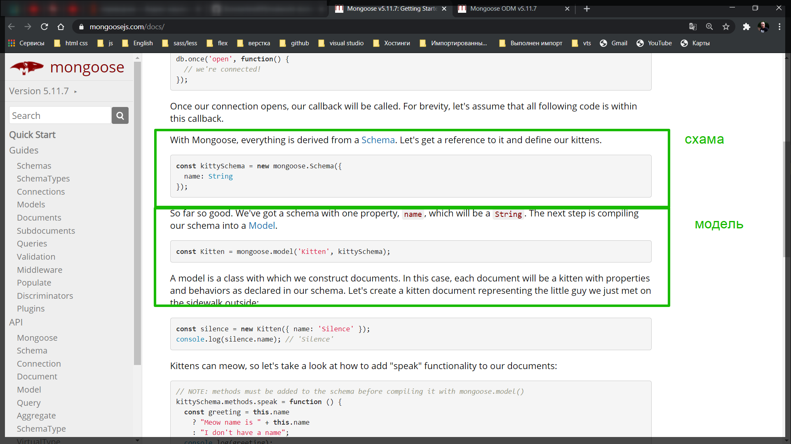
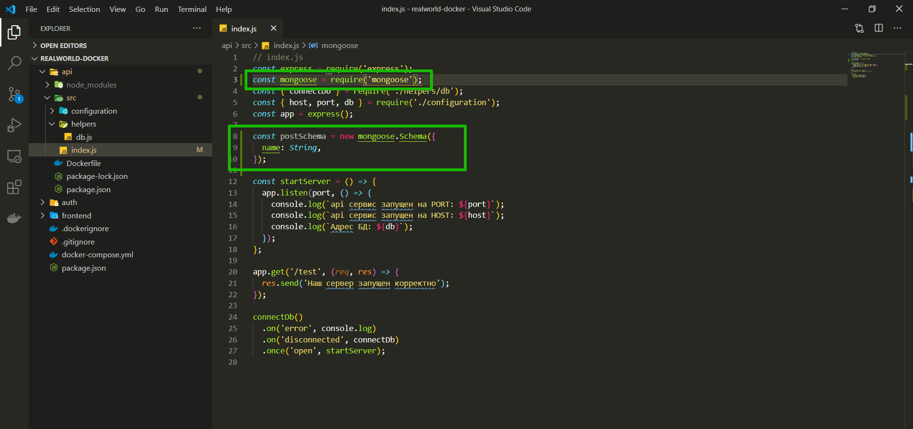
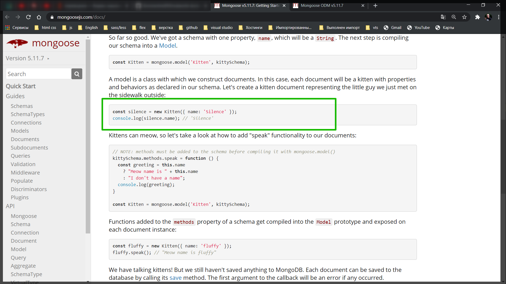
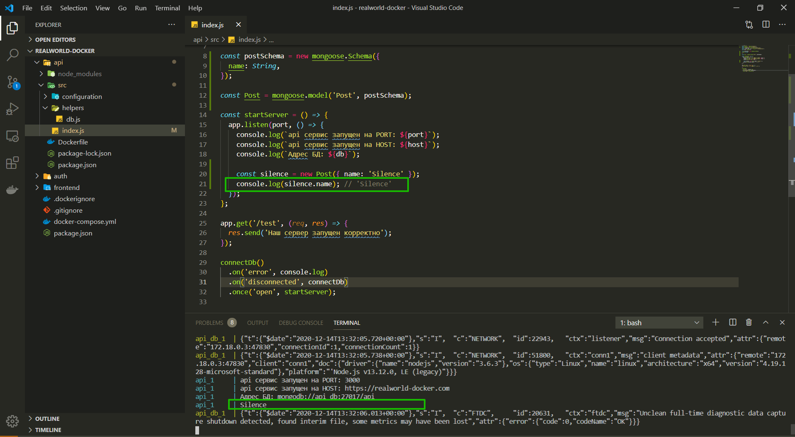
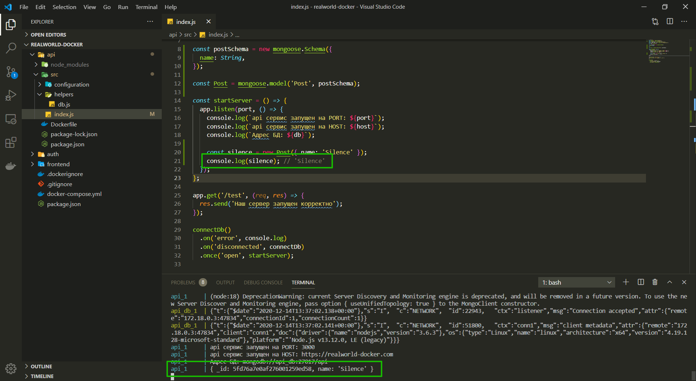
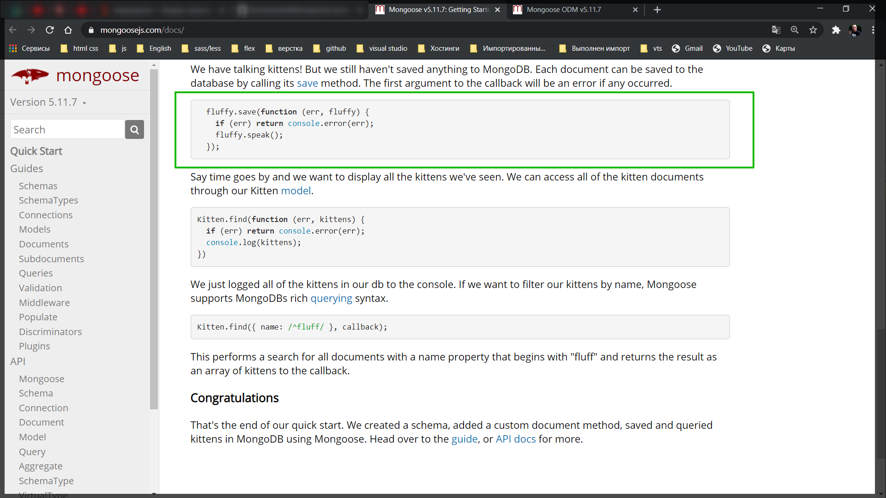
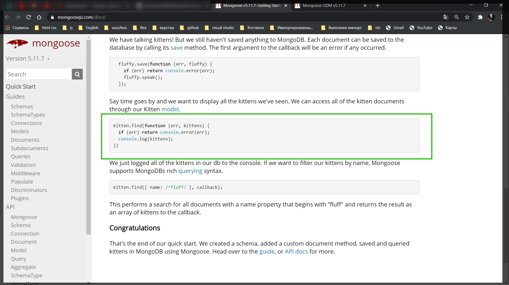
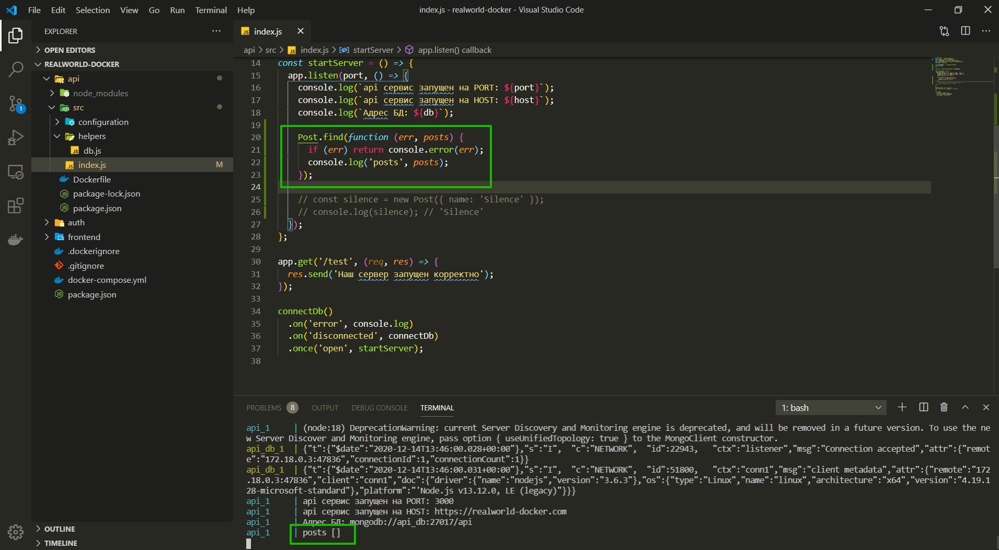
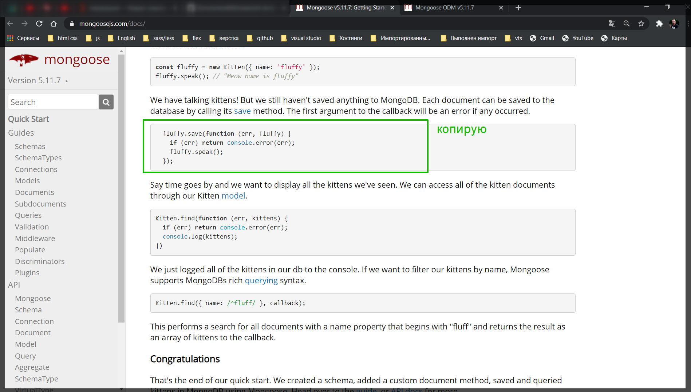
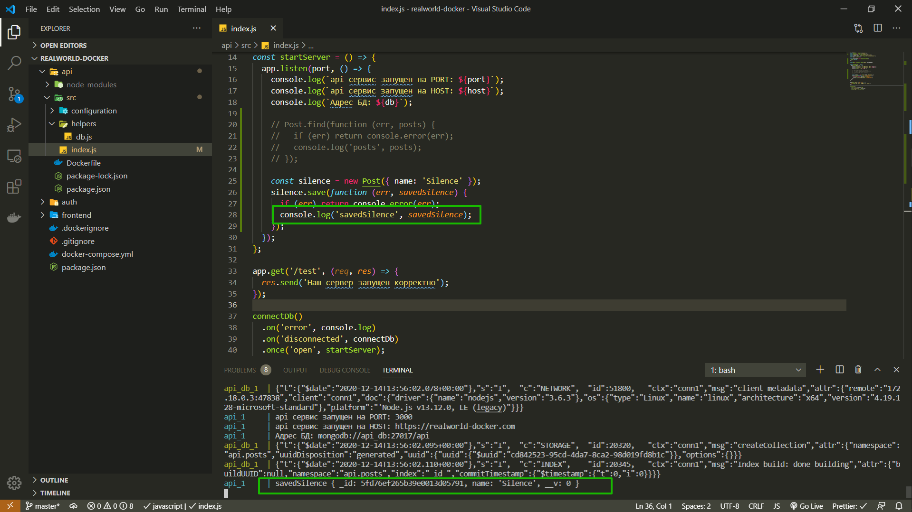

# Запросы к БД

В документации написано что сначало нам нужно создать схему. И это по факту схема нашей модели.



Мы создадим схему, модель и сохраним инстанс в БД.

В **index.js**



```js
// index.js
const express = require('express');
const mongoose = require('mongoose');
const { connectDb } = require('./helpers/db');
const { host, port, db } = require('./configuration');
const app = express();

const postSchema = new mongoose.Schema({
  name: String,
});

const startServer = () => {
  app.listen(port, () => {
    console.log(`api сервис запущен на PORT: ${port}`);
    console.log(`api сервис запущен на HOST: ${host}`);
    console.log(`Адрес БД: ${db}`);
  });
};

app.get('/test', (req, res) => {
  res.send('Наш сервер запущен корректно');
});

connectDb()
  .on('error', console.log)
  .on('disconnected', connectDb)
  .once('open', startServer);
```

Далее создаю моделью **const Kitten = mongoose.model('Kitten', kittySchema);** переписываю на свой лад.

```js
// index.js
const express = require('express');
const mongoose = require('mongoose');
const { connectDb } = require('./helpers/db');
const { host, port, db } = require('./configuration');
const app = express();

const postSchema = new mongoose.Schema({
  name: String,
});

const Post = mongoose.model('Post', postSchema);

const startServer = () => {
  app.listen(port, () => {
    console.log(`api сервис запущен на PORT: ${port}`);
    console.log(`api сервис запущен на HOST: ${host}`);
    console.log(`Адрес БД: ${db}`);
  });
};

app.get('/test', (req, res) => {
  res.send('Наш сервер запущен корректно');
});

connectDb()
  .on('error', console.log)
  .on('disconnected', connectDb)
  .once('open', startServer);
```

Теперь я могу создавать инстансы. Как вы видите здесь



мы можем написать например при старте нашего приложения..

```js
// index.js
const express = require('express');
const mongoose = require('mongoose');
const { connectDb } = require('./helpers/db');
const { host, port, db } = require('./configuration');
const app = express();

const postSchema = new mongoose.Schema({
  name: String,
});

const Post = mongoose.model('Post', postSchema);

const startServer = () => {
  app.listen(port, () => {
    console.log(`api сервис запущен на PORT: ${port}`);
    console.log(`api сервис запущен на HOST: ${host}`);
    console.log(`Адрес БД: ${db}`);

    const silence = new Post({ name: 'Silence' });
    console.log(silence.name); // 'Silence'
  });
};

app.get('/test', (req, res) => {
  res.send('Наш сервер запущен корректно');
});

connectDb()
  .on('error', console.log)
  .on('disconnected', connectDb)
  .once('open', startServer);
```



Если я при выводе в консоль удалю вызываемый метод и и оставлю просто **silence**. Пересоберу проект, то увижу что у него есть **id**.

```js
// index.js
const express = require('express');
const mongoose = require('mongoose');
const { connectDb } = require('./helpers/db');
const { host, port, db } = require('./configuration');
const app = express();

const postSchema = new mongoose.Schema({
  name: String,
});

const Post = mongoose.model('Post', postSchema);

const startServer = () => {
  app.listen(port, () => {
    console.log(`api сервис запущен на PORT: ${port}`);
    console.log(`api сервис запущен на HOST: ${host}`);
    console.log(`Адрес БД: ${db}`);

    const silence = new Post({ name: 'Silence' });
    console.log(silence); // 'Silence'
  });
};

app.get('/test', (req, res) => {
  res.send('Наш сервер запущен корректно');
});

connectDb()
  .on('error', console.log)
  .on('disconnected', connectDb)
  .once('open', startServer);
```



Это объект со специальным полем **id**. Это означает что это готовый объект который мы можем сохранить в **mongoDB**.

У каждого инстанса есть метод **save** с помощью которого я могу сохранить в БД.



Так же для начало я могу сделать **find**



Закоменчиваю прошлый код и делаю поиск **posts**

```js
// index.js
const express = require('express');
const mongoose = require('mongoose');
const { connectDb } = require('./helpers/db');
const { host, port, db } = require('./configuration');
const app = express();

const postSchema = new mongoose.Schema({
  name: String,
});

const Post = mongoose.model('Post', postSchema);

const startServer = () => {
  app.listen(port, () => {
    console.log(`api сервис запущен на PORT: ${port}`);
    console.log(`api сервис запущен на HOST: ${host}`);
    console.log(`Адрес БД: ${db}`);

    Post.find(function (err, posts) {
      if (err) return console.error(err);
      console.log('posts', posts);
    });

    // const silence = new Post({ name: 'Silence' });
    // console.log(silence); // 'Silence'
  });
};

app.get('/test', (req, res) => {
  res.send('Наш сервер запущен корректно');
});

connectDb()
  .on('error', console.log)
  .on('disconnected', connectDb)
  .once('open', startServer);
```



Это происходит потому что я пока что ничего не сохранил в БД.



```js
// index.js
const express = require('express');
const mongoose = require('mongoose');
const { connectDb } = require('./helpers/db');
const { host, port, db } = require('./configuration');
const app = express();

const postSchema = new mongoose.Schema({
  name: String,
});

const Post = mongoose.model('Post', postSchema);

const startServer = () => {
  app.listen(port, () => {
    console.log(`api сервис запущен на PORT: ${port}`);
    console.log(`api сервис запущен на HOST: ${host}`);
    console.log(`Адрес БД: ${db}`);

    // Post.find(function (err, posts) {
    //   if (err) return console.error(err);
    //   console.log('posts', posts);
    // });

    const silence = new Post({ name: 'Silence' });
    silence.save(function (err, savedSilence) {
      if (err) return console.error(err);
      console.log('savedSilence', savedSilence);
    });
  });
};

app.get('/test', (req, res) => {
  res.send('Наш сервер запущен корректно');
});

connectDb()
  .on('error', console.log)
  .on('disconnected', connectDb)
  .once('open', startServer);
```



Вот это \_\_v: 0 значит что элемент был сохранен.
