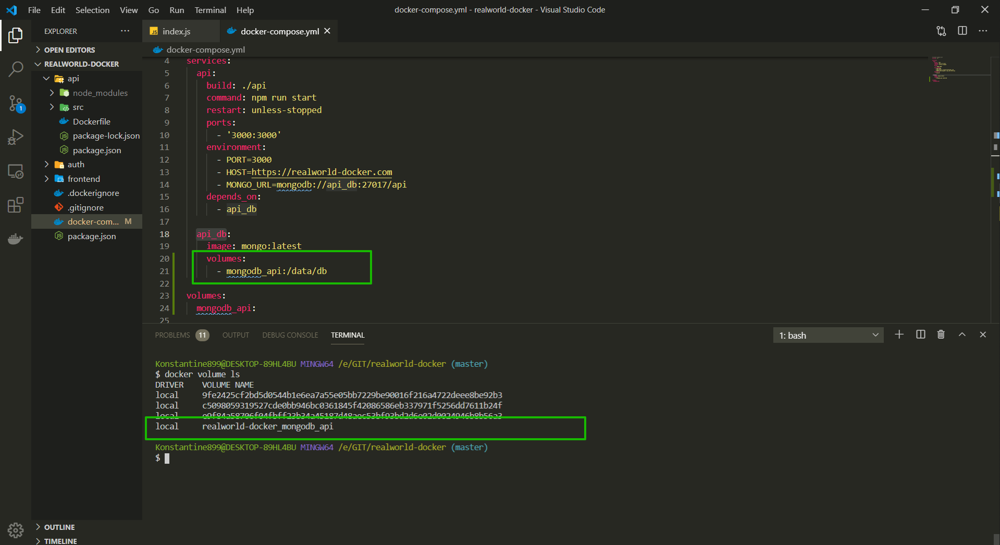

# Хранилище

У нас есть одна серьезная проблема. Каждый раз когда мы пересобираем наш контейнер все данные внутри удаляются. Мы это не замечаем до определенного момента потому что каждый раз когда мы делаем **build** мы копируем абсолютно все файлы в **docker** контейнер и все работает.

Но если мы сделали какие-то изменения в коде. После чего пересобираем проект. Унас копируются новые файлы внутрь контейнера а старые удаляются. В итоге выглядит так как буд-то мы просто обновили файл.

На самом деле возникает проблема когда мы работаем с БД.
Каждый раз когда мы пересобираем контейнер БД, просто как любое хранилище, будет тоже удалена. Соответственно нам нужно БД хранить не в контейнере.

Естественно нам не всегда полезно удалять все при сборке контейнера.

Для этого в **Docker** есть такая штука как **volumes**(тома).
Если мы посмотрим в документацию [https://docs.docker.com/storage/volumes/](https://docs.docker.com/storage/volumes/)


Идея в том что это что-то дополнительное не в контейнере где мы можем хранить наши данные, нарпимер БД или файлы которые мы изменяем. Т.е. мы хотим хранить файлы БД не в контейнере.

Для этого в **docker-compose.yml**. Пишу **volumes:** с новой строки через тире я должен написать какое-то название, например **-mongodb_api**(после названия mongodb всегда указываю название сервиса api). После двоеточия указываю **/data/db**. Обычно данные **MongoDB** храняться в **data/db** на **Linux** когда у нас установлена **MongoDB**. Т.е. наши данные которые лежат внутри **volumes** будут ссылаться внутрь контейнера по пути **data/db**. Соответственно с помощью данной ссылки мы как бы подменяем наши данные в контейнере, данными из **volumes** т.е. к примеру локального хранилища.

Далее в **root** путе я прописываю **volumes:** и в его свойства прописываю **mongodb_api:** Что это нам дает? Идея в том что **volumes** используется не только для хранения данных, а еще что бы происходило взаимодействие сервисов с этими данными.

```yml
# docker-compose.yml
version: '3'

services:
  api:
    build: ./api
    command: npm run start
    restart: unless-stopped
    ports:
      - '3000:3000'
    environment:
      - PORT=3000
      - HOST=https://realworld-docker.com
      - MONGO_URL=mongodb://api_db:27017/api
    depends_on:
      - api_db

  api_db:
    image: mongo:latest
    volumes:
      - mongodb_api:/data/db

volumes:
  mongodb_api:
```

Если я написал вот так


То мы можем использовать эти данные и этот **volume** т.е. **mongodb_api:** в любом нашем сервисе если нам это нужно.

Пробую перезапустить проект.

```shell
docker-compose up --build
```

Появляется предупреждение. Проблема в том что в предыдущем контейнере **/data/db** небыло **volume**. Однако **Docker** сразу подсказывает как это пофиксить. У меня предупреждение не такое. Я просто перезапустил контейнер и **warning** пропал.

Но сделаю такую команду как у него

```shell
docker-compose rm api_db
```

И перезапускаю

```shell
docker-compose up --build
```

Как мы можем проверить создался ли у нас **volume**?

Проверка

```shell
docker volume
```


Выдает разные команды для работы с **volume**.

```shell
docker volume ls
```



Это volume который я только что описал. И как вы видите по имени и префиксу нашего проекта что это именно он.

Рассмотрим еще один пример который нам тоже нужен.
Для **Production** понятно мы запускаем просто сборку проекта. У нас есть **Dockerfile**

```Dockerfile
# Dockerfile
FROM node:13.12.0-alpine

WORKDIR /usr/src/app

COPY package*.json ./

RUN npm install

COPY  . .
```

И внутри мы просто копируем все файлы.

Но когда мы разрабатываем локально, то мы хотим что бы когда мы сделали минимальное изменение, что бы нам не нужно было пересобирать все для того что бы увидить эти изменения.

Создаю еще один **docker-compose**. Идея в том что один **docker-compose** будет для **production** а второй для **development**. Создаю **docker-compose.development.yml**. Он будет отвечать за локальную разработку.

Мы хотим перезаписать поля которые хотим видит другими.

```yml
# docker-compose.development.yml
version: '3'

services:
  api:
```

Далее я хочу другую команду запуска **command: npm run dev**. После чего здесь будут другие **volumes:** Сновой строки **- ./api/src:/usr/src/app/src**. Что это означает? Это тоже самое как мы написаль здесь

```yml
# docker-compose.development.yml
version: '3'

services:
  api:
    command: npm run dev
    volumes:
      - ./api/src:/usr/src/app/src
```


Этот **volume** идет **inline**(встроенный) и его ни кто не сожет переиспользовать поскольку у него нет имени. Слева **./api/src:** это путь к файлам т.е. к папке **src**. Это означает что мы хотим перейти к этой папке по пути **/usr/src/app/src**. Т.е. мы ничего не перезаписываем внутри app но внутри app мы хотим запрать **src** с нашей машины.

Теперь мы хотим реализовать команду **command: npm run dev** таким образом что бы при каждом сохранении перезапускался **web-server**. Для этого подходит
[https://www.npmjs.com/package/nodemon](https://www.npmjs.com/package/nodemon)

перехожу в папку **api** и устанавливаю **nodemon**.

```shell
cd api
```

```shell
npm install -g nodemon
```

Теперь в **package.json** создаю новую команду **"dev": "nodemon"**

```json
{
  "name": "api",
  "version": "1.0.0",
  "description": "",
  "main": "index.js",
  "scripts": {
    "start": "node src/index.js",
    "dev": "nodemon"
  },
  "author": "",
  "license": "ISC",
  "dependencies": {
    "express": "^4.17.1",
    "mongoose": "^5.11.7"
  },
  "devDependencies": {
    "nodemon": "^2.0.6"
  }
}
```


Теперь создаю конфиг для **nodemon**. В папке **api** создаю **nodemon.json**


```json
{
  "verbose": false,
  "watch": ["src"],
  "exec": "node src/index.js"
}
```

Теперь нужно запускать не

```shell
docker-compose up --build
```

поскольку тогда он использует стандартный **docker-compose.yml.**

Для того что бы войти в режиме разработки использую флаг **-f**. Это вызывает указание файла т.е. мы указываем какой файл мы хотим.

```shell
docker-compose -f docker-compose.yml -f docker-compose.development.yml up --build
```

Что происходит при этой команде? Мы берем все поля из **docker-compose.yml** и переписываем эти поля полями которые определены в **docker-compose.development.yml**


