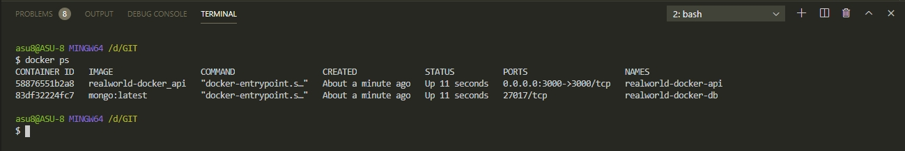
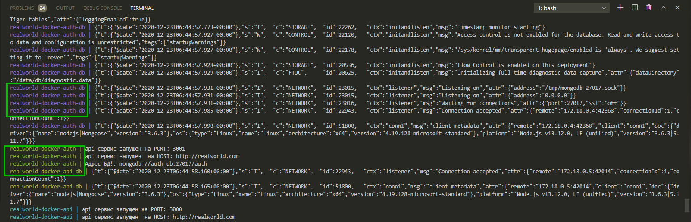
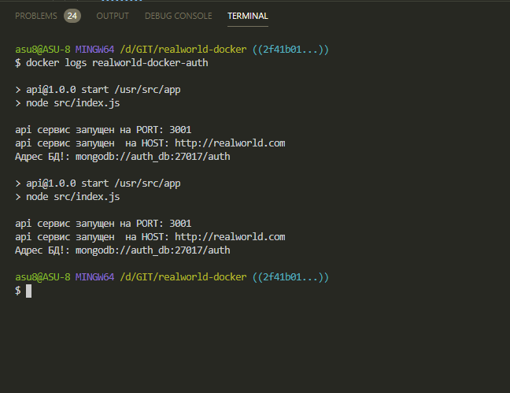
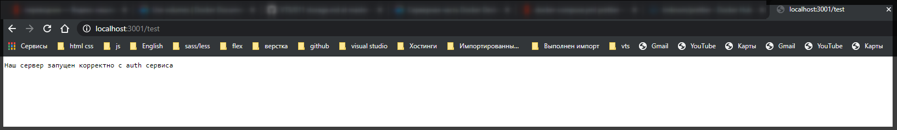

# Сервис авторизации

Создаю сервис для аутентификации. Мы можем скопировать папку **api** в папку **auth**. мы напасали наш **api** на **node.js**. А в папке **auth** мы можем ввести разработку на других языках программирования. И ничто нам в этом не мешает так как это полностью изолированные части приложения.

В корне создаю **auth** и копирую туда содержимое папки **api**.


В **index.js** меняем код. Удаляю схему и модель. Удаляю все что было связано с тестированием БД. Так же здесь я перестал использовать **mongoose**. Удаляю.

```js
// index.js
const express = require('express');
const { connectDb } = require('./helpers/db');
const { host, port, db } = require('./configuration');
const app = express();

const startServer = () => {
  app.listen(port, () => {
    console.log(`api сервис запущен на PORT: ${port}`);
    console.log(`api сервис запущен  на HOST: ${host}`);
    console.log(`Адрес БД!: ${db}`);
  });
};

app.get('/test', (req, res) => {
  res.send('Наш сервер запущен корректно');
});

connectDb()
  .on('error', console.log)
  .on('disconnected', connectDb)
  .once('open', startServer);
```

Смотрю контейнеры

```shell
docker ps
```

Для удобства я могу именовать контейнеры. В **docker-compose.yml** я могу каждый сервис именовать.Для этого каждому сервису задаю **container_name:** Далее я предпочитаю точное название сервисов т.е. указываю название проекта и далее указываю префикс т.е. название сервиса.

```yml
version: '3'

services:
  api:
    build: ./api
    container_name: realworld-docker-api
    command: npm run start
    restart: unless-stopped
    ports:
      - '3000:3000'
    environment:
      - PORT=3000
      - HOST=http://realworld.com
      - MONGO_URL=mongodb://api_db:27017/api
    depends_on:
      - api_db

  api_db:
    image: mongo:latest
    container_name: realworld-docker-db
    volumes:
      - mongodb_api:/data/db

volumes:
  mongodb_api:
```

Перезапускаю

```shell
docker-compose up
```

И смотрю отличаются ли наши процессы. В другом терминале просматриваю контейнеры и вижу что их имена отличаются.



Имена контейнеров переименованы. Т.е. до этого были рандомные имена, а сейсас строго именованные.

Теперь добавляю новый **services** в **docker-compose.yml**

И так наш новый сервис это **auth** и его папка это **build: ./auth**. Далее указываю имя контейнера **container_name: realworld-docker-auth**. Теперь какая же у нас будет команда. Такая же как и в нашем api т.е. **command: npm run start**.
Далее перезапуск контейнеры **restart: unless-stopped**. Теперь нужно добавить порты **ports: -"3001:3001"**. После этого указываю переменные окружения **enviroment: - PORT=3001**. это важно **ports** и **enviroment PORTS** должны совпадать. Далее указываю переменную **- HOST=https://realworld-docker.com**. Далее необходимо указать **- MONGO_URL=mongodb://auth_db:27017/auth**.

Далее в **depends_on:** указываю что сначало хочу запустить нашу **- auth_db** которую мы сейчас создадим, а уже потом **auth_service**.

Теперь точно так же как мы создавали **api_db** создаю **auth_db**.

**auth_db:** и здесь я указываю что мне нужен образ **image:mongo:latest**. Указываю имя **container_name: realworld-docker-auth-db**. И дальше **volumes:** т.е. мы хотим сохранить нашу базу и поэтому здесь создаем именованый **volumes: - mongodb_auth:** и здесь тоже будет **/data/db**.

И теперь в самом нижнем **volumes** мне нужно добавить **mongo_dbauth:**

```yml
version: '3'

services:
  api:
    build: ./api
    container_name: realworld-docker-api
    command: npm run start
    restart: unless-stopped
    ports:
      - '3000:3000'
    environment:
      - PORT=3000
      - HOST=http://realworld.com
      - MONGO_URL=mongodb://api_db:27017/api
    depends_on:
      - api_db

  auth:
    build: ./auth
    container_name: realworld-docker-auth
    command: npm run start
    restart: unless-stopped
    ports:
      - '3001:3001'
    environment:
      - PORT=3001
      - HOST=http://realworld.com
      - MONGO_URL=mongodb://auth_db:27017/auth

  api_db:
    image: mongo:latest
    container_name: realworld-docker-api-db
    volumes:
      - mongodb_api:/data/db

  auth_db:
    image: mongo:latest
    container_name: realworld-docker-auth-db
    volumes:
      - mongodb_auth:/data/db

volumes:
  mongodb_api:
  mongodb_auth:
```

Пересобираю проект

```shell
docker-compose up --build
```



Все запустилось и я получаю логи от **realworld-docker-auth-db**

Помни что если не удобно читать много логов всегда можно посмотреть логи по имени сервиса.




