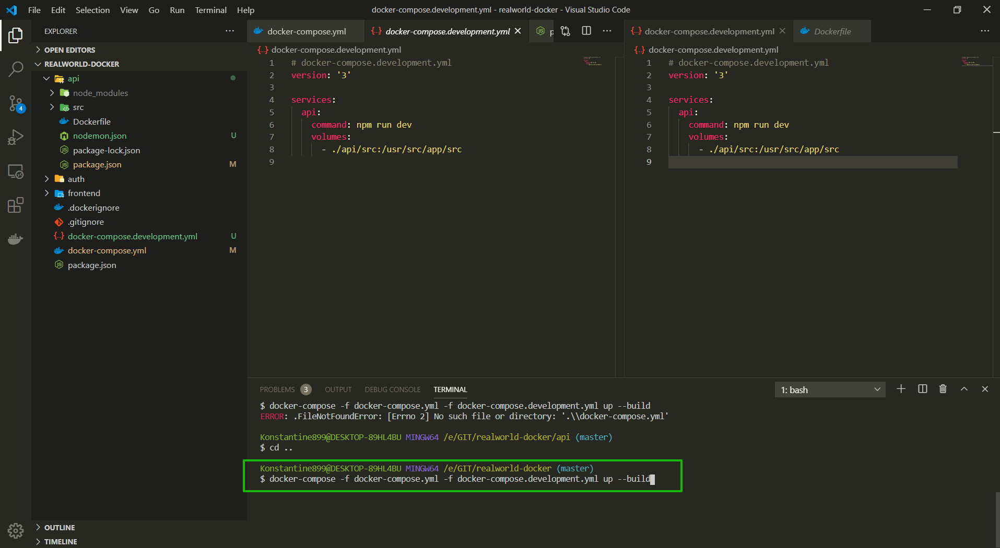

# Сервис авторизации

Создаю сервис для аутентификации. Мы можем скопировать папку api в папку auth. мы напасали наш api на node.js. А в папке auth мы можем ввести разработку на других языках программирования. И ничто нам в этом не мешает так как это полностью изолированные части приложения.

В корне создаю auth и копирую туда содержимое папки api.



В index.js меняем код. Удаляю схему и модель. Удаляю все что было связано с тестированием БД. Так же здесь я перестал использовать mongoose. Удаляю.

```js
// index.js
const express = require('express');
const { connectDb } = require('./helpers/db');
const { host, port, db } = require('./configuration');
const app = express();

const startServer = () => {
  app.listen(port, () => {
    console.log(`api сервис запущен на PORT: ${port}`);
    console.log(`api сервис запущен  на HOST: ${host}`);
    console.log(`Адрес БД!: ${db}`);
  });
};

app.get('/test', (req, res) => {
  res.send('Наш сервер запущен корректно');
});

connectDb()
  .on('error', console.log)
  .on('disconnected', connectDb)
  .once('open', startServer);
```

Смотрю контейнеры

```shell
docker ps
```

Для удобства я могу именовать контейнеры. В docker-compose.yml я могу каждый сервис именовать.Для этого каждому сервису задаю container_name: Далее я предпочитаю точное название сервисов т.е. указываю название проекта и далее указываю префикс т.е. название сервиса.

```yml
version: '3'

services:
  api:
    build: ./api
    container_name: realworld-docker-api
    command: npm run start
    restart: unless-stopped
    ports:
      - '3000:3000'
    environment:
      - PORT=3000
      - HOST=http://realworld.com
      - MONGO_URL=mongodb://api_db:27017/api
    depends_on:
      - api_db

  api_db:
    image: mongo:latest
    container_name: realworld-docker-db
    volumes:
      - mongodb_api:/data/db

volumes:
  mongodb_api:
```

Перезапускаю
