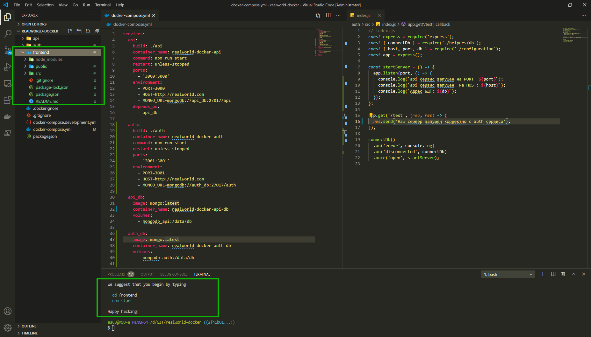
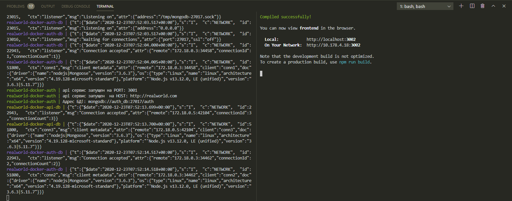
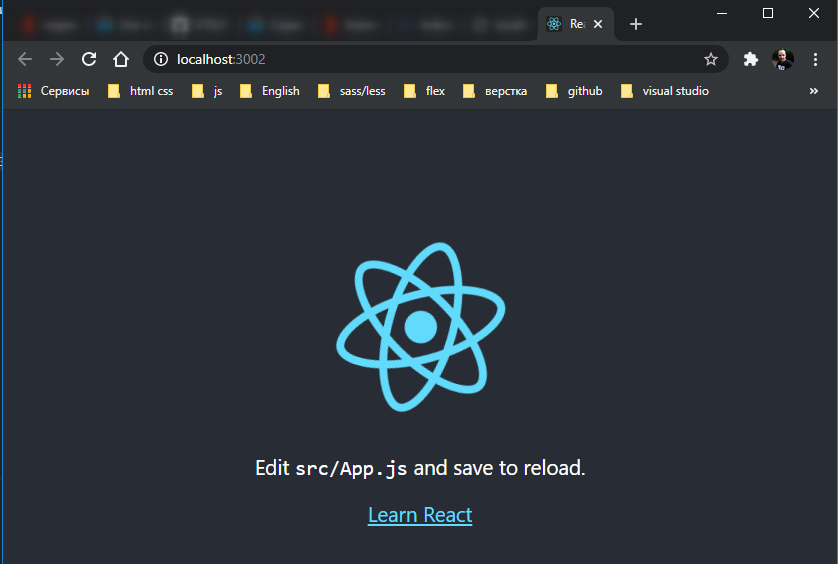
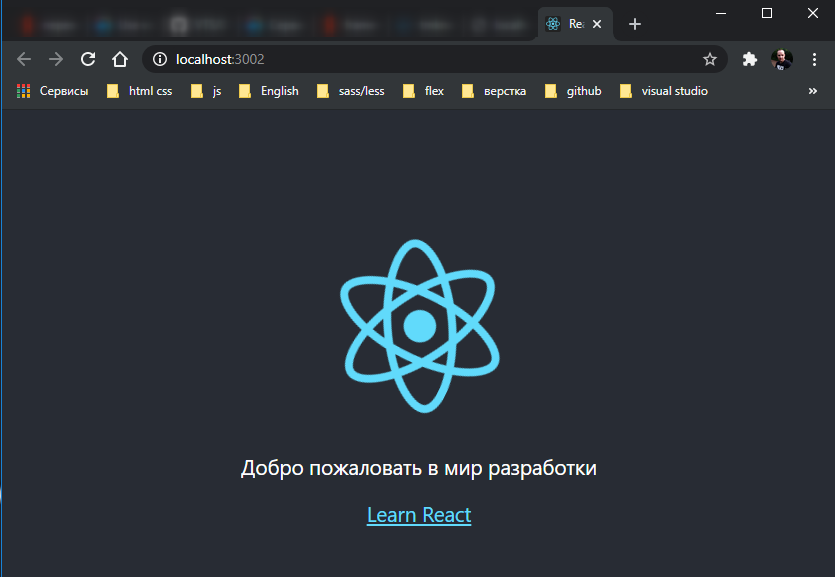
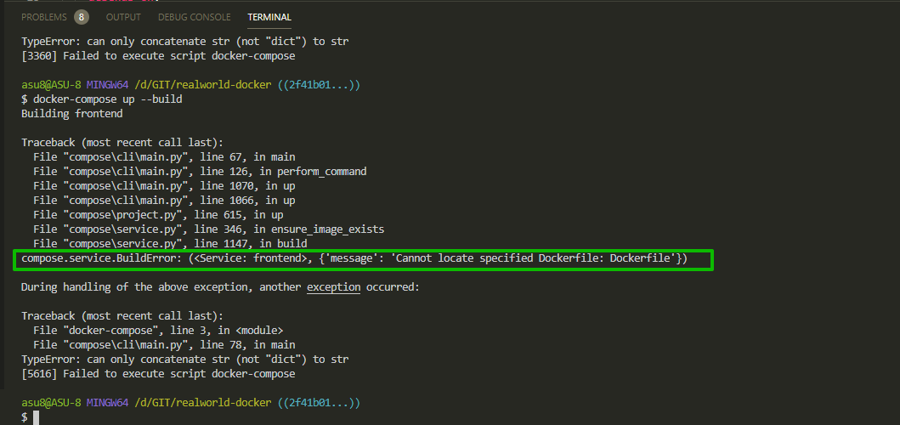
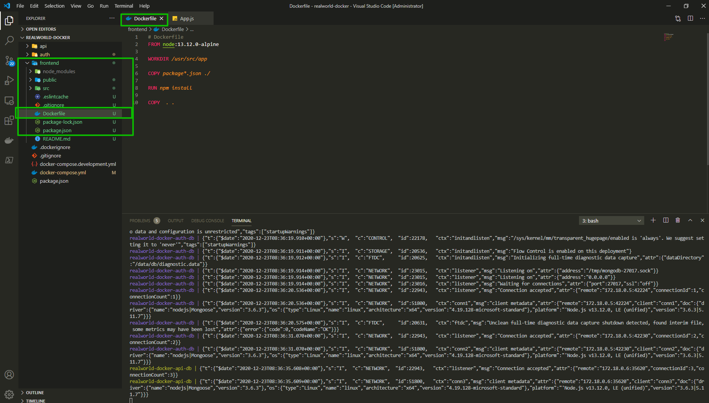
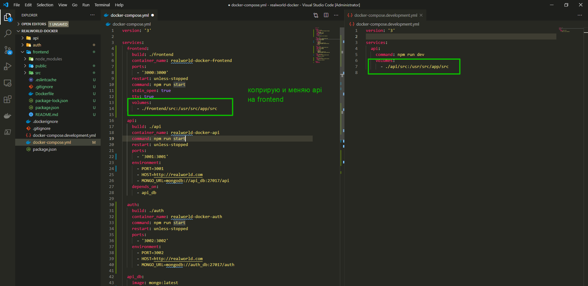

# Сервис frontend

Создавать **docker-compose.yml** достаточно проблематично если у вас нет достаточно опыта. Потому что есть много переменных. Не всегда понятно что с чем делать. Но потом когда мы его запускаем одной командой и все работает это то чего мы добиваемся.

Если же мы говорим о **frontend** то все еще хуже. Например

```shell
create react app
```

Так же как например как например веб-сервер **angular** и любого другого **framework** имеет ряд проблем когда мы работаем с **docker**.

Во-первых у **React** есть интерактивная консоль. Это значит что когда мы например запускаем

```
npm start
```

У нас **react** может что-то спросить, например что на этом порту уже что-то используется, запустить на другом порту? И вы в консоли пишете **yes**. **Docker** такие вещи из коробки делать не может по-этому с этим приходится бороться.\

Вторая проблема что изменение в этих веб сервисах происходит по **web-socket**. Это значить что у вас запускаются **socket**, потом вы делаете изменение в файле например. Это видят нодовские сокеты. Отправляют на сервер update презагрузи страницу. И у вас в браузере перезагружается страница.

В **React** проект создается таким образом.

```shell
npm init react-app my-app
```

**my-app** -название проекта.

В корне проекта создаю папку т.е. это проект реакта

```shell
npm init react-app frontend
```



После усановки я могу зайти в папку **frontend** и запустить

```shell
npm run start
```



Спрашивет можно ли запустить на другом порту т.к. на 3000 запущен **docker**



Если я что-то меняю в файле **app.js** то при сохранении файла по веб-сокетам происходит обновление браузера и вывод обновленной информации.



Теперь мы хотим внутри **docker** добится такоже поведения.

В **docker-compose.yml** в верху файла в **services:** прописываю новый сервис **frontend:** указываю папку **build: ./frontend**. Далее указываю имя контейнера **container_name:realworld-docker-frontend.** Далее пришу команду для запуска сервера. Пока что в этом видио пишу команду как для **dev** сервера. Хотя реально здесь должен быть **production** код. **command: npm run start**. Далее добавляю порты **ports:** и на самом деле я хочу здесь оставить **3000** порт т.к. это будет более удобно.

Переопределяю порты других сервисов.

Объявляю **restart:unless-stopped**

```yml
version: '3'

services:
  frontend:
    build: ./frontend
    container_name: realworld-docker-frontend
    command: npm run start
    ports:
      - '3000:3000'
    restart: unless-stopped

  api:
    build: ./api
    container_name: realworld-docker-api
    command: npm run start
    restart: unless-stopped
    ports:
      - '3001:3001'
    environment:
      - PORT=3001
      - HOST=http://realworld.com
      - MONGO_URL=mongodb://api_db:27017/api
    depends_on:
      - api_db

  auth:
    build: ./auth
    container_name: realworld-docker-auth
    command: npm run start
    restart: unless-stopped
    ports:
      - '3002:3002'
    environment:
      - PORT=3002
      - HOST=http://realworld.com
      - MONGO_URL=mongodb://auth_db:27017/auth

  api_db:
    image: mongo:latest
    container_name: realworld-docker-api-db
    volumes:
      - mongodb_api:/data/db

  auth_db:
    image: mongo:latest
    container_name: realworld-docker-auth-db
    volumes:
      - mongodb_auth:/data/db

volumes:
  mongodb_api:
  mongodb_auth:
```

После чего в сервис **frontend:** я хочу добавить несколько комманд которые нужны только для **frontend**. Если я сейчас запущу **frontend** то он не заработает именно из-за интерактивной консоли.

Если вы начнете гуглить то обнаружите вот это [https://github.com/facebook/create-react-app/issues/8688](https://github.com/facebook/create-react-app/issues/8688).

Т.к. я успользую **docker-compose** то в нем можно указать два специальных **property** которые позволят работать интерактивно с консолью. Первое свойство это **stdin_open: true** и **tty: true**

```yml
version: '3'

services:
 frontend:
    build: ./frontend
    container_name: realworld-docker-frontend
    ports:
      - "3000:3000"
    restart: unless-stopped
    command: npm run start
    stdin_open: true
    tty: true

  api:
    build: ./api
    container_name: realworld-docker-api
    command: npm run start
    restart: unless-stopped
    ports:
      - '3001:3001'
    environment:
      - PORT=3001
      - HOST=http://realworld.com
      - MONGO_URL=mongodb://api_db:27017/api
    depends_on:
      - api_db

  auth:
    build: ./auth
    container_name: realworld-docker-auth
    command: npm run start
    restart: unless-stopped
    ports:
      - '3002:3002'
    environment:
      - PORT=3002
      - HOST=http://realworld.com
      - MONGO_URL=mongodb://auth_db:27017/auth

  api_db:
    image: mongo:latest
    container_name: realworld-docker-api-db
    volumes:
      - mongodb_api:/data/db

  auth_db:
    image: mongo:latest
    container_name: realworld-docker-auth-db
    volumes:
      - mongodb_auth:/data/db

volumes:
  mongodb_api:
  mongodb_auth:
```



Ошибка. Для решения он пишет что для **frontend** нужно создать точно такой же **Dockerfile**. По-этому копирую и вставляю.



Приложение запускается. Однако если мы сейчас внесем изменения, то ничего не произойдет. Это происходит потому что мы не создали **volume** для **frontend**.
я его просто копирую из нашего **docker-compose.development.yml** и просто добавляю в сервис **frontend**



```yml
version: '3'

services:
  frontend:
    build: ./frontend
    container_name: realworld-docker-frontend
    ports:
      - '3000:3000'
    restart: unless-stopped
    command: npm run start
    stdin_open: true
    tty: true
    volumes:
      - ./frontend/src:/usr/src/app/src

  api:
    build: ./api
    container_name: realworld-docker-api
    command: npm run start
    restart: unless-stopped
    ports:
      - '3001:3001'
    environment:
      - PORT=3001
      - HOST=http://realworld.com
      - MONGO_URL=mongodb://api_db:27017/api
    depends_on:
      - api_db

  auth:
    build: ./auth
    container_name: realworld-docker-auth
    command: npm run start
    restart: unless-stopped
    ports:
      - '3002:3002'
    environment:
      - PORT=3002
      - HOST=http://realworld.com
      - MONGO_URL=mongodb://auth_db:27017/auth

  api_db:
    image: mongo:latest
    container_name: realworld-docker-api-db
    volumes:
      - mongodb_api:/data/db

  auth_db:
    image: mongo:latest
    container_name: realworld-docker-auth-db
    volumes:
      - mongodb_auth:/data/db

volumes:
  mongodb_api:
  mongodb_auth:
```

Пересобираю проект и смотрю

```shell
docker-compose up --build
```

> Наварное дней пять потратил для того что бы найти решение проблемы горячей перезагрузки. Вся проблема заключалась в том что при изменении файла, данные изменения не попадали в контейнер. Решением данной проблемы оказалось в **service** **frontend** в файле **docker-compose.yml**, нужно было добавить переменную окружения

```yml
environment:
  - CHOKIDAR_USEPOLLING=true
```

Читай здесь [https://mherman.org/blog/dockerizing-a-react-app/](https://mherman.org/blog/dockerizing-a-react-app/).

Полный рабочий фал **docker-compose.yml**

```yml
version: '3'

services:
  frontend:
    build: ./frontend
    container_name: realworld-docker-frontend
    command: npm run start
    ports:
      - '3000:3000'
    restart: unless-stopped
    environment:
      - CHOKIDAR_USEPOLLING=true
    stdin_open: true
    tty: true
    volumes:
      - ./frontend/src:/usr/src/app/src
      - ./frontend/public:/usr/src/app/public

  api:
    build: ./api
    container_name: realworld-docker-api
    command: npm run start
    restart: unless-stopped
    ports:
      - '3001:3001'
    environment:
      - PORT=3001
      - HOST=http://realworld.com
      - MONGO_URL=mongodb://api_db:27017/api
    depends_on:
      - api_db

  auth:
    build: ./auth
    container_name: realworld-docker-auth
    command: npm run start
    restart: unless-stopped
    ports:
      - '3002:3002'
    environment:
      - PORT=3002
      - HOST=http://realworld.com
      - MONGO_URL=mongodb://auth_db:27017/auth

  api_db:
    image: mongo:latest
    container_name: realworld-docker-api-db
    volumes:
      - mongodb_api:/data/db

  auth_db:
    image: mongo:latest
    container_name: realworld-docker-auth-db
    volumes:
      - mongodb_auth:/data/db

volumes:
  mongodb_api:
  mongodb_auth:
```
