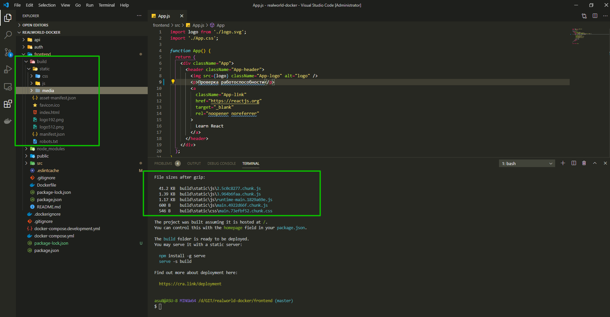
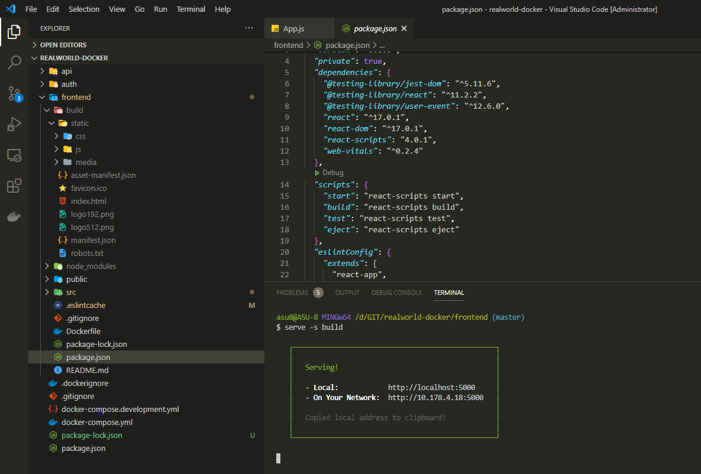
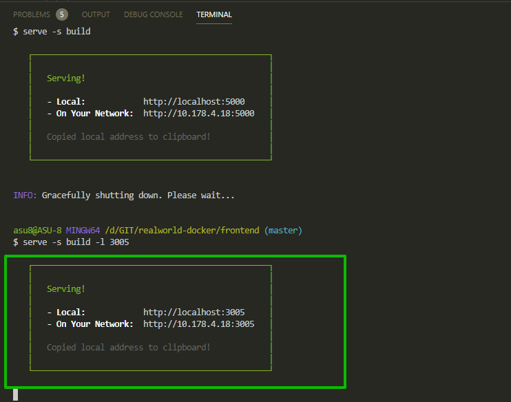
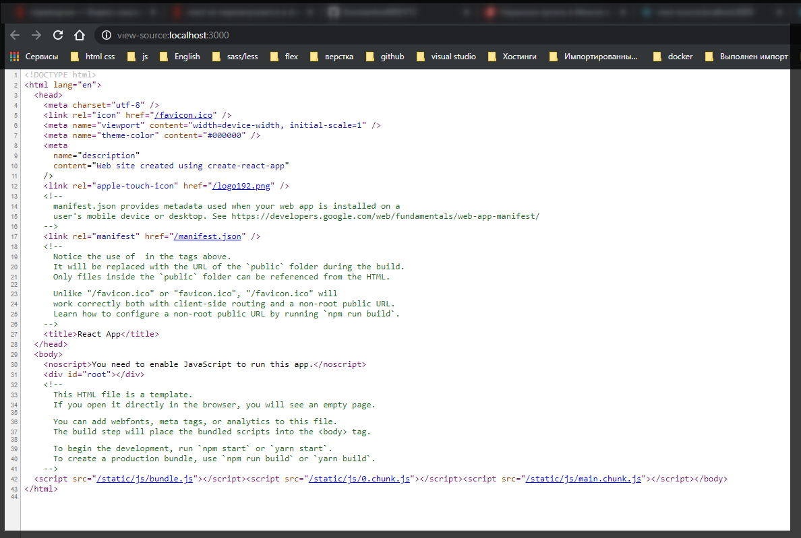

# frontend в продакшен

Вопрос заключается в том как мы вообще будем запускать наш **frontend** в **production**. Перехожу в папку **frontend** и пишу команду

```shell
npm run build
```

т.е. теперьв папке build есть



нам так же предлагается установить **static server** или любой сервер который вам нужен **server -s build**. И после установки **server -s build** мы можем использовать нашу статику.

```shell
npm install -g serve
```

Теперь если я напишу

```shell
serve -s build
```

теперь serve смотрит папку **build**. И теперь я могу перейти по **localhost:5000** и посмотреть код страницы в браузере я увижу что код минифицирован.



Т.е. это код **production build**. Так же с помощью флага **-l** я погу указать на коком порту хочу запустить статический сервер.

```shell
serve -s build -l 3005
```



Это именно то что я хочу использовать внутри **Docker**. Нам необходимо когда мы делаем сборку проекта нам необходимо установить данные пакет в **serve** в контейнер.

В **Dockerfile** я, который находится в сервисе **frontend**, прописываю **RUN npm run build** и дальше **RUN npm inatall -g serve** т.е. это установит глобально наш serve пакет котрый будет нам этот **build** показывать.

```Dockerfile
# Dockerfile
FROM node:13.12.0-alpine

WORKDIR /usr/src/app

COPY package*.json ./

RUN npm install

COPY  . .

RUN npm run build

RUN npm install -g serve
```

Так же возникает вопрос почему мы пишем в **Dockerfile** ... **RUN npm run build** и

**RUN npm install -g serve** если они необходимы только для **production** а не для **development**. Позже мы их вынесем.

И теперь в **docker-compose.yml** я могу использовать не **command: npm run start** а **command: serve -s build -l 3000**

```yml
version: '3'

services:
  frontend:
    build: ./frontend
    container_name: realworld-docker-frontend
    command: serve -s build -l 3000
    ports:
      - '3000:3000'
    restart: unless-stopped
    # environment:
    #   - CHOKIDAR_USEPOLLING=true
    # stdin_open: true
    # tty: true
    volumes:
      - ./frontend/src:/usr/src/app/src
      - ./frontend/public:/usr/src/app/public

  api:
    build: ./api
    container_name: realworld-docker-api
    command: npm run start
    restart: unless-stopped
    ports:
      - '3001:3001'
    environment:
      - PORT=3001
      - HOST=http://realworld.com
      - MONGO_URL=mongodb://api_db:27017/api
    depends_on:
      - api_db

  auth:
    build: ./auth
    container_name: realworld-docker-auth
    command: npm run start
    restart: unless-stopped
    ports:
      - '3002:3002'
    environment:
      - PORT=3002
      - HOST=http://realworld.com
      - MONGO_URL=mongodb://auth_db:27017/auth

  api_db:
    image: mongo:latest
    container_name: realworld-docker-api-db
    volumes:
      - mongodb_api:/data/db

  auth_db:
    image: mongo:latest
    container_name: realworld-docker-auth-db
    volumes:
      - mongodb_auth:/data/db

volumes:
  mongodb_api:
  mongodb_auth:
```

Коментирую

```yml
# environment:
# #   - CHOKIDAR_USEPOLLING=true
# # stdin_open: true
# # tty: true
# volumes:
#   - ./frontend/src:/usr/src/app/src
#   - ./frontend/public:/usr/src/app/public
```

И пересобираю проект

```shell
docker-compose up --build
```

При проверке кода страницы код минифицирован т.е. наша сборка работает так как надо. Таким образомы мы можем показывать нашу статику для **production**.

Теперь необходимо в **docker-compose.development.yml** переместить то что мы писали для нашей разработки.

Создаю сервис frontend:и первое что я должен сделать это написать **command:npm run start**. Далее беру закоментированный код в **docker-compose.yml** вырезаю его, и вставляю в **docker-compose.devekopment.yml** в наш сервис **frontend**.

```yml
# docker-compose.development.yml
version: '3'

services:
  frontend:
    command: npm run start
    environment:
      - CHOKIDAR_USEPOLLING=true
    stdin_open: true
    tty: true
    volumes:
      - ./frontend/src:/usr/src/app/src
      - ./frontend/public:/usr/src/app/public
  api:
    command: npm run dev
    volumes:
      - ./api/src:/usr/src/app/src
```

Перезапускаю

```shell
docker-compose -f docker-compose.yml -f docker-compose.development.yml up --build
```

И вот код в режиме разработки.



горячая перезагрузка так же работает.
