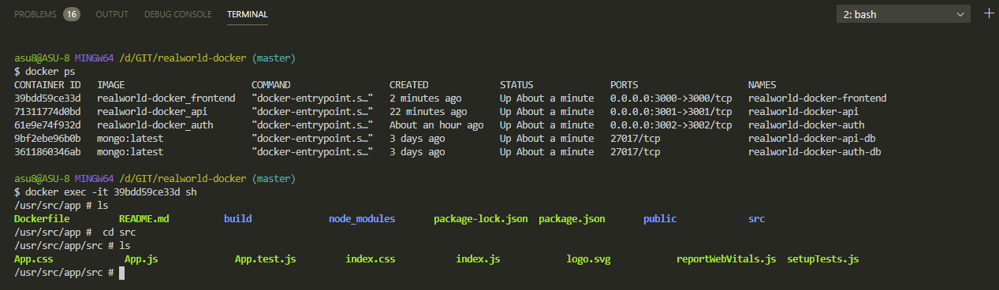
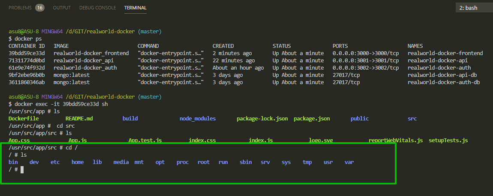

# Docker exec

При запущенном контейнере запускаю команду например.

```shell
docker exec -it 39bdd59ce33d sh
```

sh - значит shell.



И здесь работают обычные команды linux. И я нахожусь внутри контейнера. Таким образом я могу посмотреть на файлы которые скопировались в контейнер.

Мы можем зайти в root т.е. в корень и посмотреть что это обычные папки обычного linux



Я могу устанавливать зависимости внутри контейнера, запускать проект и т.д.
