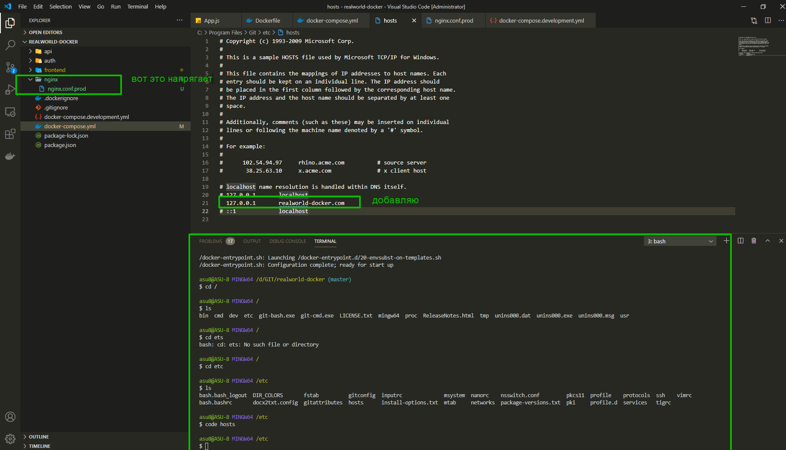
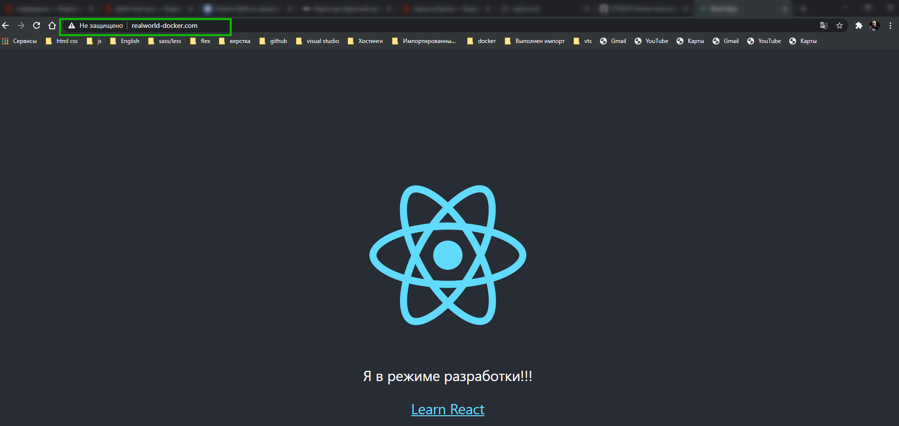

# Настройки Nginx

Официальный сайт [https://www.nginx.com/resources/wiki/](https://www.nginx.com/resources/wiki/)

Он нужен для связки контейнеров. Плюс к этому он позволяет добавлять статику, какие-то статические серверы.

Создаю сервис **enginx** в **docker-compose.yml**. И у него указываю **image: nginx:stable-alpine**. **alpine** это для минификации образа. Далее задаю имя контейнеру **conteiner_name: realworld-docker-nginx**. Дальше порты **ports: - "80:80"**. Далее пишу **volumes:** т.к. у нас будет файл конфигурации **nginx** т.е. **- ./nginx/nginx.conf.prod:/etc/nginx/conf.d/nginx.conf**. Т.е. будет создан файл для продакшена и помещен в контейнер. И последнее что нужно сделать это **depends_on: - frontend**. Делаю я это для того что бы сервис frontend был доступен раньше чем сервис **enginx**. Потому что **eginx** упадет потому что он не сможет спроксировать запрос на сервис который запускается.

```yml
version: '3'

services:
  frontend:
    build: ./frontend
    container_name: realworld-docker-frontend
    command: serve -s build -l 3000
    ports:
      - '3000:3000'
    restart: unless-stopped

  api:
    build: ./api
    container_name: realworld-docker-api
    command: npm run start
    restart: unless-stopped
    ports:
      - '3001:3001'
    environment:
      - PORT=3001
      - HOST=http://realworld.com
      - MONGO_URL=mongodb://api_db:27017/api
    depends_on:
      - api_db

  auth:
    build: ./auth
    container_name: realworld-docker-auth
    command: npm run start
    restart: unless-stopped
    ports:
      - '3002:3002'
    environment:
      - PORT=3002
      - HOST=http://realworld.com
      - MONGO_URL=mongodb://auth_db:27017/auth

  api_db:
    image: mongo:latest
    container_name: realworld-docker-api-db
    volumes:
      - mongodb_api:/data/db

  auth_db:
    image: mongo:latest
    container_name: realworld-docker-auth-db
    volumes:
      - mongodb_auth:/data/db

   nginx:
    image: nginx:stable-alpine
    container_name: realworld-docker-nginx
    ports:
      - "80:80"
    volumes:
      - ./nginx/nginx.conf.prod:/etc/nginx/conf.d/nginx.conf
    depends_on:
      - frontend

volumes:
  mongodb_api:
  mongodb_auth:
```

Единственное, что очень важно, проверить что на вашей машине ничего не занимает **80 порт**. Обычно локально это занимает сам **nginx** поэтому его нужно остановить. Проверить это я могу

```shell
ps aux | grep nginx
```

Создаю **config**. Для этого создаю в корне новую папку **nginx** и в ней **nginx.conf.prod**. и так же будет конфиг для **development** но позже.

В **nginx.conf.prod** создаю объект **server{}**. В нем пишу **listen 80**, и **server_name realworld-docker.com**. Главное не поставить **:** а то все поломается.

И далее я указываю **location / {}**. Это значит что все запросы которые придут на **/** , и не важно что идет дальше, будут проксированы. И для этого я пишу **proxi_pass http://frontend:3000;**

```nginx
server{
  listen 80;

  server_name realworld-docker.com;

  location / {
    proxy_pass http://frontend:3000;
  }
}
```

Самое интересное здесь http://frontend:3000; это host frontend существует только в сети **docker-compose**. сети разберем позже.

Собираю проект и смотрю логи **nginx**



Это значит что поиск происходит не в интернете а на **localhost**. Этот запрос попадет на наш **nginx**

Перехожу по c:\windows\system32\drivers\ets\hosts

и вношу **127.0.0.1 realworld-docker.com**. Теперь при обращении в адресной строке к **realworld-docker.com** происходит обращение к локальной машине и отображение страницы.


