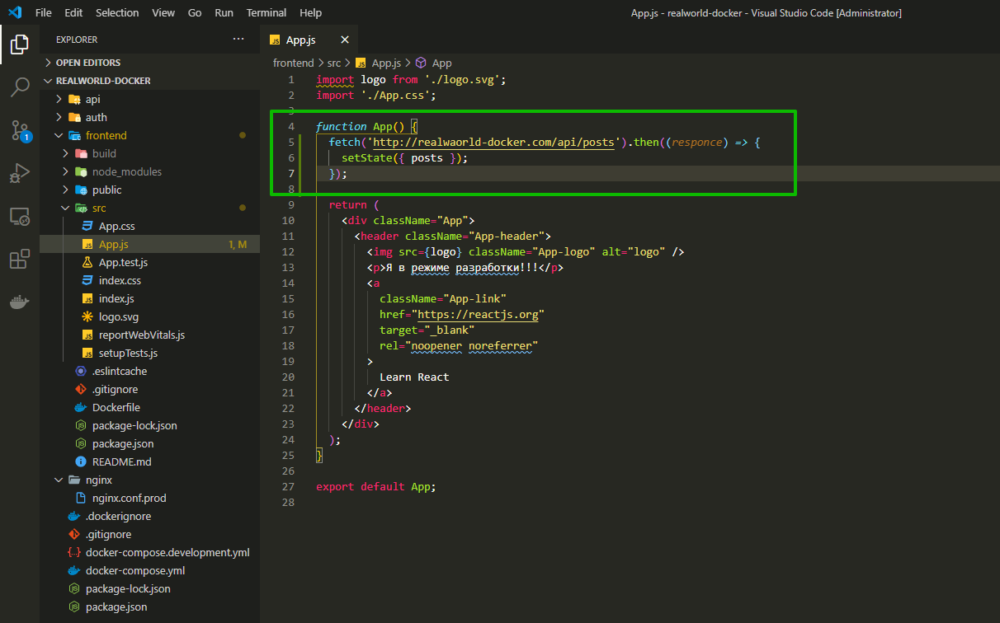
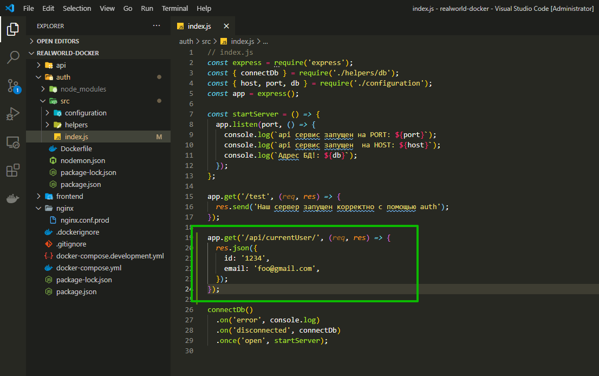
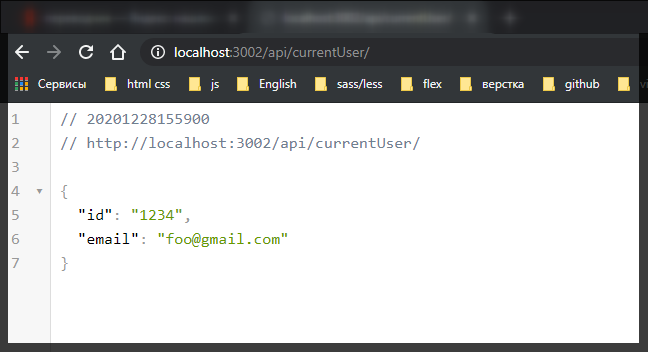
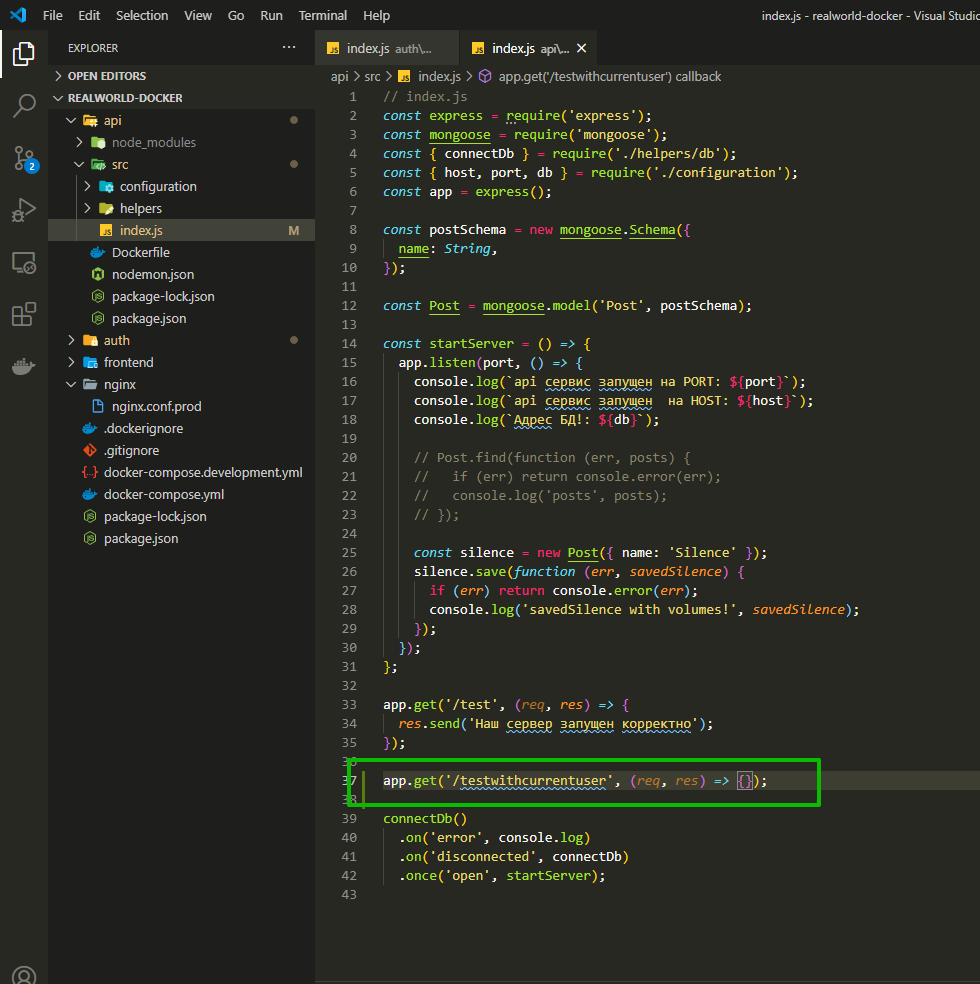
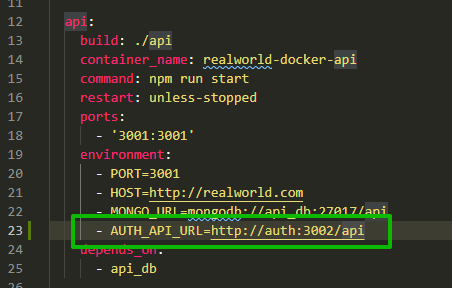
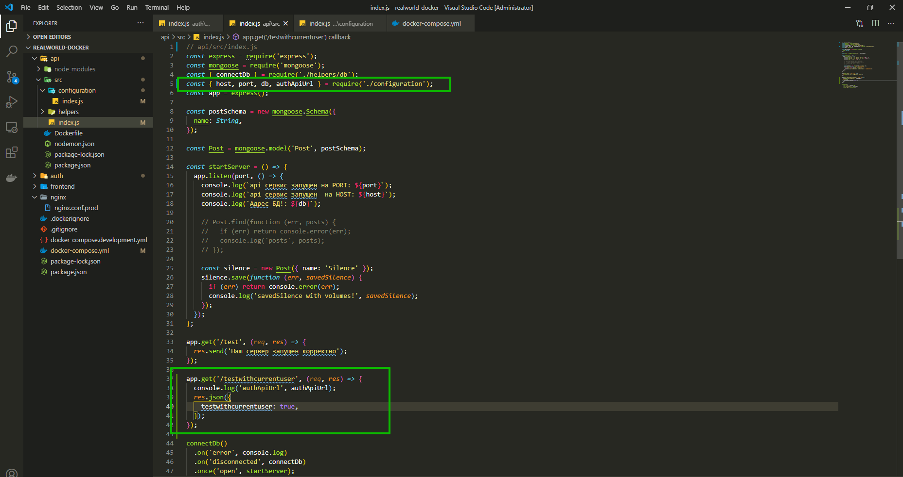
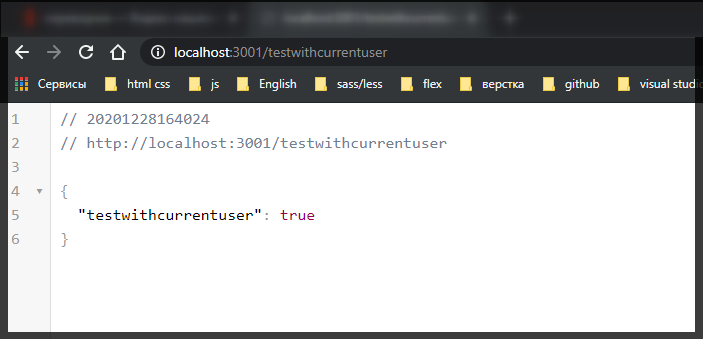
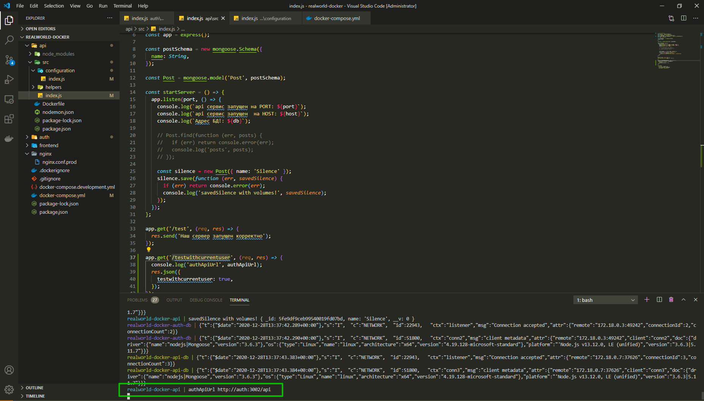

# Проксирую API запросы

Поговорим как проксировать запросы с сервиса на сервис. Самый простой пример. У нас есть папка frontend, src и файл app.js. И мы хотим fetch получить какие-то данные от нашего api. Например я хочу получить что-то подобное.



```js
import logo from './logo.svg';
import './App.css';

function App() {
  fetch('http://realwaorld-docker.com/api/posts').then((responce) => {
    setState({ posts });
  });

  return (
    <div className="App">
      <header className="App-header">
        
        <p>Я в режиме разработки!!!</p>
        <a
          className="App-link"
          href="https://reactjs.org"
          target="_blank"
          rel="noopener noreferrer"
        >
          Learn React
        </a>
      </header>
    </div>
  );
}

export default App;
```

Т.е. мне нужно с frontend делать запросы. На код не обращай внимания он не валидный.

С api я хочу обратиться к auth. Это нужно для того что бы при запросе данных происходила проверка залогинен пользователь или нет. Или как минимум получить данные текущего пользователя что бы что-то сравнить.

Нужно настроить так что бы все запросы между сервисами правильно работали.

Настраиваю запросы между auth и api. Запросы с frontend сложнее. Перехожу в auth/src/index.js и пишу тестовый запрос.

Я хочу обратится к сервису авторизации. Сщздаю роут /api/currentUser. Здесь мы с вами не будем проверять токен и что-то возврачать в базу.



```js
// auth/src/index.js
const express = require('express');
const { connectDb } = require('./helpers/db');
const { host, port, db } = require('./configuration');
const app = express();

const startServer = () => {
  app.listen(port, () => {
    console.log(`api сервис запущен на PORT: ${port}`);
    console.log(`api сервис запущен  на HOST: ${host}`);
    console.log(`Адрес БД!: ${db}`);
  });
};

app.get('/test', (req, res) => {
  res.send('Наш сервер запущен корректно с помощью auth');
});

app.get('/api/currentUser/', (req, res) => {
  res.json({
    id: '1234',
    email: 'foo@gmail.com',
  });
});

connectDb()
  .on('error', console.log)
  .on('disconnected', connectDb)
  .once('open', startServer);
```

```shell
docker-compose up --build
```



Это наш тестовый api который отдает текущего пользователя.

Теперь я хочу получить fetch эти данные внутри нашего api. в api/src/index.js и здесь я хочу создать новый url в котором я буду возвращать какие-то данные использую user с авторизации auth.



```js
// index.js
const express = require('express');
const mongoose = require('mongoose');
const { connectDb } = require('./helpers/db');
const { host, port, db } = require('./configuration');
const app = express();

const postSchema = new mongoose.Schema({
  name: String,
});

const Post = mongoose.model('Post', postSchema);

const startServer = () => {
  app.listen(port, () => {
    console.log(`api сервис запущен на PORT: ${port}`);
    console.log(`api сервис запущен  на HOST: ${host}`);
    console.log(`Адрес БД!: ${db}`);

    // Post.find(function (err, posts) {
    //   if (err) return console.error(err);
    //   console.log('posts', posts);
    // });

    const silence = new Post({ name: 'Silence' });
    silence.save(function (err, savedSilence) {
      if (err) return console.error(err);
      console.log('savedSilence with volumes!', savedSilence);
    });
  });
};

app.get('/test', (req, res) => {
  res.send('Наш сервер запущен корректно');
});

app.get('/testwithcurrentuser', (req, res) => {});

connectDb()
  .on('error', console.log)
  .on('disconnected', connectDb)
  .once('open', startServer);
```

Мы хотим здесь вызвать запрос в наш сервер auth api и когда мы получили данные, только тогда мы хотим вернуть ответ. Вопрос как же нам это сделать? Вопервых нам необходимо указать в переменных окружения какой у нас будет базовый url.
Это очень удобно делать для того что бы мы точно знали какой у нас api снаружи а не внутри нашего сервиса. module.exports.authApiUrl = process.env.AUTH_API_URL;

```js
// api/src/configuration/index.js
module.exports.port = process.env.PORT;
module.exports.host = process.env.HOST;
module.exports.db = process.env.MONGO_URL;
module.exports.authApiUrl = process.env.AUTH_API_URL;
```

Теперь AUTH_API_URL необходимо создать в docker-compose.yml



```yml
version: '3'

services:
  frontend:
    build: ./frontend
    container_name: realworld-docker-frontend
    command: serve -s build -l 3000
    ports:
      - '3000:3000'
    restart: unless-stopped

  api:
    build: ./api
    container_name: realworld-docker-api
    command: npm run start
    restart: unless-stopped
    ports:
      - '3001:3001'
    environment:
      - PORT=3001
      - HOST=http://realworld.com
      - MONGO_URL=mongodb://api_db:27017/api
      - AUTH_API_URL=http://auth:3002/api
    depends_on:
      - api_db

  auth:
    build: ./auth
    container_name: realworld-docker-auth
    command: npm run start
    restart: unless-stopped
    ports:
      - '3002:3002'
    environment:
      - PORT=3002
      - HOST=http://realworld.com
      - MONGO_URL=mongodb://auth_db:27017/auth

  api_db:
    image: mongo:latest
    container_name: realworld-docker-api-db
    volumes:
      - mongodb_api:/data/db

  auth_db:
    image: mongo:latest
    container_name: realworld-docker-auth-db
    volumes:
      - mongodb_auth:/data/db

  nginx:
    image: nginx:stable-alpine
    container_name: realworld-docker-nginx
    ports:
      - '80:80'
    volumes:
      - ./nginx/nginx.conf.prod:/etc/nginx/conf.d/nginx.conf
    depends_on:
      - frontend

volumes:
  mongodb_api:
  mongodb_auth:
```

Так же видите здесь этот магический хост auth, точно так же мы уже использовали в mongo, и так же как мы испольховали в nginx. Как вы видите каждый сервис может обращаться к другому сервису по специальному host. И в нашем случае указывая здесь эту переменную окружения - AUTH_API_URL=http://auth:3002/api в docker-compose.yml мы точно так же оставляем наш сервис без каких либо переменных.

Соответственно я теперь могу использовать authApiUrl



```js
// api/src/index.js
const express = require('express');
const mongoose = require('mongoose');
const { connectDb } = require('./helpers/db');
const { host, port, db, authApiUrl } = require('./configuration');
const app = express();

const postSchema = new mongoose.Schema({
  name: String,
});

const Post = mongoose.model('Post', postSchema);

const startServer = () => {
  app.listen(port, () => {
    console.log(`api сервис запущен на PORT: ${port}`);
    console.log(`api сервис запущен  на HOST: ${host}`);
    console.log(`Адрес БД!: ${db}`);

    // Post.find(function (err, posts) {
    //   if (err) return console.error(err);
    //   console.log('posts', posts);
    // });

    const silence = new Post({ name: 'Silence' });
    silence.save(function (err, savedSilence) {
      if (err) return console.error(err);
      console.log('savedSilence with volumes!', savedSilence);
    });
  });
};

app.get('/test', (req, res) => {
  res.send('Наш сервер запущен корректно');
});

app.get('/testwithcurrentuser', (req, res) => {
  console.log('authApiUrl', authApiUrl);
  res.json({
    testwithcurrentuser: true,
  });
});

connectDb()
  .on('error', console.log)
  .on('disconnected', connectDb)
  .once('open', startServer);
```

Т.е. здесь мы пока ни каких данных не запрашиваем, а просто выводим в консоль.

Если я пересобиру проект и вобъю в адресную строку http://localhost:3001/testwithcurrentuser



И после чего смотрю в консоль.



Это то что мы указали через переменные окружения.

Теперь осталось просто запросить данные currentuser c сервиса авторизации. И для запроса данных я предпочитаю использовать библиотеку axios.
