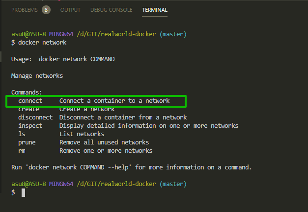

# Docker сети

Я хочу проговорить про **docker network** которые были автоматически созданы.

Но сначало давайте на примере как мы вызвали **currentUserApi** внутри **api** сделаем наоборот. Поскольку иногда нам необходимо получить какие-то данные от **api** внутри нашего **auth** сервиса.
Например если нам необходимо вернуть все статьи пользователя которые он залайкал и т.д.

Первое что нужно сделать это добавить новую переменную окружения. В **docker-compose.yml** меняю переменную окружения - **AUTH_API_URL=http://auth:3002/api** на **- API_URL=http://api:3001/api** и добавляю ее в сервис **auth**, а **AUTH_API_URL=http://auth:3002/api** оставляю в сервисе api. т.е. косякнул....

Рабочий файл

```yml
version: '3'

services:
  frontend:
    build: ./frontend
    container_name: realworld-docker-frontend
    command: serve -s build -l 3000
    restart: unless-stopped

  api:
    build: ./api
    container_name: realworld-docker-api
    command: npm run start
    restart: unless-stopped
    ports:
      - '3001:3001'
    environment:
      - PORT=3001
      - HOST=http://realworld.com
      - MONGO_URL=mongodb://api_db:27017/api
      - AUTH_API_URL=http://auth:3002/api

    depends_on:
      - api_db

  auth:
    build: ./auth
    container_name: realworld-docker-auth
    command: npm run start
    restart: unless-stopped
    ports:
      - '3002:3002'
    environment:
      - PORT=3002
      - HOST=http://realworld.com
      - MONGO_URL=mongodb://auth_db:27017/auth
      - API_URL=http://api:3001/api

  api_db:
    image: mongo:latest
    container_name: realworld-docker-api-db
    volumes:
      - mongodb_api:/data/db

  auth_db:
    image: mongo:latest
    container_name: realworld-docker-auth-db
    volumes:
      - mongodb_auth:/data/db

  nginx:
    image: nginx:stable-alpine
    container_name: realworld-docker-nginx
    ports:
      - '80:80'
    volumes:
      - ./nginx/nginx.conf.prod:/etc/nginx/conf.d/nginx.conf
    depends_on:
      - frontend

volumes:
  mongodb_api:
  mongodb_auth:
```

Далее захожу в **auth** и здесь тоже необходимо установить **axios**

```shell
npm install axios
```

Далее захожу в **api** и создаю новый запрос который мы потом будем забирать в **auth** сервисе т.е. мы хотим проверить что мы можем получить эти данные вдругом сервисе.


```js
// api/src/index.js
const express = require('express');
const mongoose = require('mongoose');
const axios = require('axios');
const { connectDb } = require('./helpers/db');
const { host, port, db, authApiUrl } = require('./configuration');
const app = express();

const postSchema = new mongoose.Schema({
  name: String,
});

const Post = mongoose.model('Post', postSchema);

const startServer = () => {
  app.listen(port, () => {
    console.log(`api сервис запущен на PORT: ${port}`);
    console.log(`api сервис запущен  на HOST: ${host}`);
    console.log(`Адрес БД!: ${db}`);

    // Post.find(function (err, posts) {
    //   if (err) return console.error(err);
    //   console.log('posts', posts);
    // });

    const silence = new Post({ name: 'Silence' });
    silence.save(function (err, savedSilence) {
      if (err) return console.error(err);
      console.log('savedSilence with volumes!', savedSilence);
    });
  });
};

app.get('/test', (req, res) => {
  res.send('Наш сервер запущен корректно');
});

app.get('/api/testapidata', (req, res) => {
  res.json({
    testwithapi: true,
  });
});

app.get('/testwithcurrentuser', (req, res) => {
  axios.get(authApiUrl + '/currentUser').then((responce) => {
    res.json({
      testwithcurrentuser: true,
      currentUserFromAuth: responce.data,
    });
  });
});

connectDb()
  .on('error', console.log)
  .on('disconnected', connectDb)
  .once('open', startServer);
```

т.е. мы здесь не обращаемся к БД. Важно что бы эти данные, этот запрос, мы могли запросить с нашего **auth** сервиса.

Теперь захожу в **auth/src/index.js** и здесь мы создадим еще один метод **testwithapidata**. Не забываем про подключение библиотеки.

При запросе **axios.get()**. Для этого нужен **api_url**. Перехожу в переменные окружения и добавляю **module.exports.apiUrl = process.env.API_URL;**

```js
// configuration/index.js
module.exports.port = process.env.PORT;
module.exports.host = process.env.HOST;
module.exports.db = process.env.MONGO_URL;
module.exports.apiUrl = process.env.API_URL;
```

Далее подключаю в файл в котором я хочу ее использовать.


```js
// auth/src/index.js
const express = require('express');
const axios = require('axios');
const { connectDb } = require('./helpers/db');
const { host, port, db, apiUrl } = require('./configuration');
const { response } = require('express');
const app = express();

const startServer = () => {
  app.listen(port, () => {
    console.log(`api сервис запущен на PORT: ${port}`);
    console.log(`api сервис запущен  на HOST: ${host}`);
    console.log(`Адрес БД!: ${db}`);
  });
};

app.get('/test', (req, res) => {
  res.send('Наш сервер запущен корректно с помощью auth');
});

app.get('/testwithapidata', (req, res) => {
  axios.get(apiUrl + '/testapidata').then((response) => {
    res.json({
      testapidata: response.data.testwithapi,
    });
  });
});

app.get('/api/currentUser/', (req, res) => {
  res.json({
    id: '1234',
    email: 'foo@gmail.com',
  });
});

connectDb()
  .on('error', console.log)
  .on('disconnected', connectDb)
  .once('open', startServer);
```

Естественно эта переменная просто **testwithapi** просто **true**, но нам важно что мы запросили эти данные с другого сервиса.

Пересобираю проект

```shell
docker-composre up --build
```

и смотрю работает ли команда.

Смотрю отдает ли наш запрос данные http://localhost:3001/api/testapidata


И вот возвращается ответ от нашего запроса **api**


Теперь мы из сервиса авторизации **auth** можем получать данные из нашего сервиса **api**. И так у нас сервисы между собой могут комуницировать.

Поговорим про сеть **docker**. Что это такое и зачем это нужно. В примере выше из коробки работала сеть, которую для нас создал **docker-compose**. Это нужно чтобы все сети между собой комуницировали использую хост как название сервиса.

Как же мы можем посмотреть какие у нас есть сети.

```shell
docker network
```

Мы получаем help по командам **network**. И здесь самое интересное это **ls**.


А так же мы можем вручную законектить контейнер к сети.



Или создать сеть, рассоеденится(**disconnect**) и т.д.

Естественно мы не хотим это все делать руками и по этому мы используем **docker-compose**. Как вы видите

```shell
docker network ls
```

выводит список сетей.


И не все из них понятные.

Это плохо что мы это видим вот так вот, потому что мы не можем сказать какая сеть на принадлежит. Потому что мы ее не описали в **docker-compose.yml**.

Поэтому создадим сеть и опишем ее точно как нам нужно.

Документация по сетям [https://docs.docker.com/compose/compose-file/](https://docs.docker.com/compose/compose-file/). вбивай в поисковике **networks** и читай.


В **docker-compose.yml** описываю новое поле **networks:** и здесь создадим новую сеть с префиксом как наш проект **realworld-docker-network:** и здесь нужно указать **driver:** по **default** он **bridge**. И мы хотим использовать такой же.

Теперь нам необходимо указать эту сеть во всех наших сервисах которые мы хотим к этой сети подключить.

**docker-compose.yml**

```yml
version: '3'

services:
  frontend:
    build: ./frontend
    container_name: realworld-docker-frontend
    command: serve -s build -l 3000
    restart: unless-stopped
    networks:
      - realworld-docker-network

  api:
    build: ./api
    container_name: realworld-docker-api
    command: npm run start
    restart: unless-stopped
    ports:
      - '3001:3001'
    environment:
      - PORT=3001
      - HOST=http://realworld.com
      - MONGO_URL=mongodb://api_db:27017/api
      - AUTH_API_URL=http://auth:3002/api
    depends_on:
      - api_db
    networks:
      - realworld-docker-network

  auth:
    build: ./auth
    container_name: realworld-docker-auth
    command: npm run start
    restart: unless-stopped
    ports:
      - '3002:3002'
    environment:
      - PORT=3002
      - HOST=http://realworld.com
      - MONGO_URL=mongodb://auth_db:27017/auth
      - API_URL=http://api:3001/api
    networks:
      - realworld-docker-network

  api_db:
    image: mongo:latest
    container_name: realworld-docker-api-db
    volumes:
      - mongodb_api:/data/db
    networks:
      - realworld-docker-network

  auth_db:
    image: mongo:latest
    container_name: realworld-docker-auth-db
    volumes:
      - mongodb_auth:/data/db
    networks:
      - realworld-docker-network

  nginx:
    image: nginx:stable-alpine
    container_name: realworld-docker-nginx
    ports:
      - '80:80'
    volumes:
      - ./nginx/nginx.conf.prod:/etc/nginx/conf.d/nginx.conf
    depends_on:
      - frontend
    networks:
      - realworld-docker-network

volumes:
  mongodb_api:
  mongodb_auth:

networks:
  realworld-docker-network:
    driver: bridge
```

Роуты все работают. Теперь еще раз пишу

```shell
docker network ls
```


Название не красивое. Однако используя такой подход можно объеденить два разных проекта в одну сеть. По-этому в первой чать, до префикса лучше называть названием проекта.
