# Проксирование frontend

Все думают что проксирование frontend работает как описано в предыдущем конспекте.

Пример запроса в frontend/src/App.js

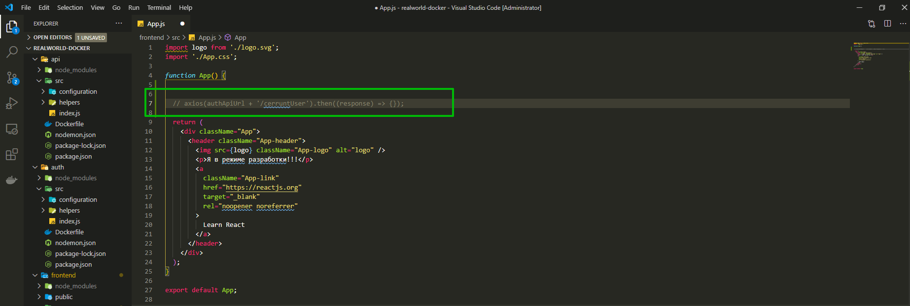

```js
import logo from './logo.svg';
import './App.css';

function App() {
  // axios(authApiUrl + '/cerruntUser').then((response) => {});

  return (
    <div className="App">
      <header className="App-header">
        
        <p>Я в режиме разработки!!!</p>
        <a
          className="App-link"
          href="https://reactjs.org"
          target="_blank"
          rel="noopener noreferrer"
        >
          Learn React
        </a>
      </header>
    </div>
  );
}

export default App;
```

Но это работать не будет.

В чем же разница?

когда мы разрабатываем backend у нас все просто. У нас есть docker, у нас есть наши сервера или сервисы. И они у нас находятся в одной сите docker.

Если же мы говорим о frontend

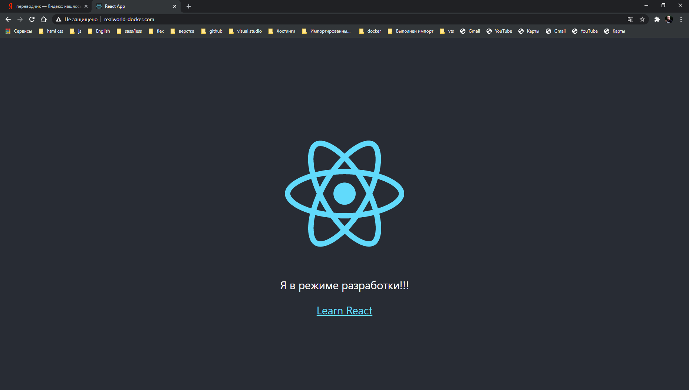

Он загружается на компьютере пользователя. Он не знает о наших серверах, о docker вообще, о сети docker. Это значит что он знает только что такое этот домен.

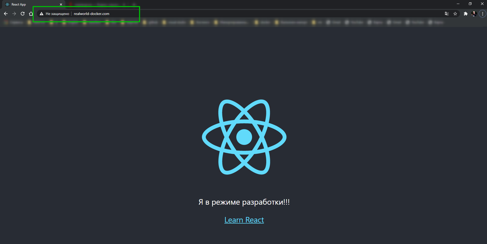

Соответственно здесь, если есть какоей-то main.js файл в котором вы написали какой-то код. Добавлять код не буду он минифицирован и в одну строку выводится.

И если мы пишем вот такую кострукцию


Естественно что ни какого http://auth здесь не будет. Соответственно мы здесь напрямую не можем достучаться до других сервисов. И это нужно просто запомнить. Все что находится в браузере не имеет ни какого отношения к docker, к сети docker и к нашим сервисам. Поэтому frontend делать немного тяжелее.

Какие же у нас есть пути решения.

Мы можем сделать то что делали до этого, expose выставить наши порты. т.е. точно так же как мы уже сделали. И тогда мы с помощью нашего api адреса и порта, к примеру такой, получить какой-то ответ.

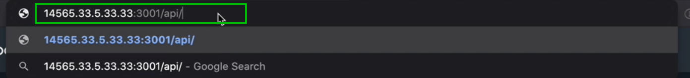

Т.е. мы берем просто наш frontend, вот здесь пишем этот url

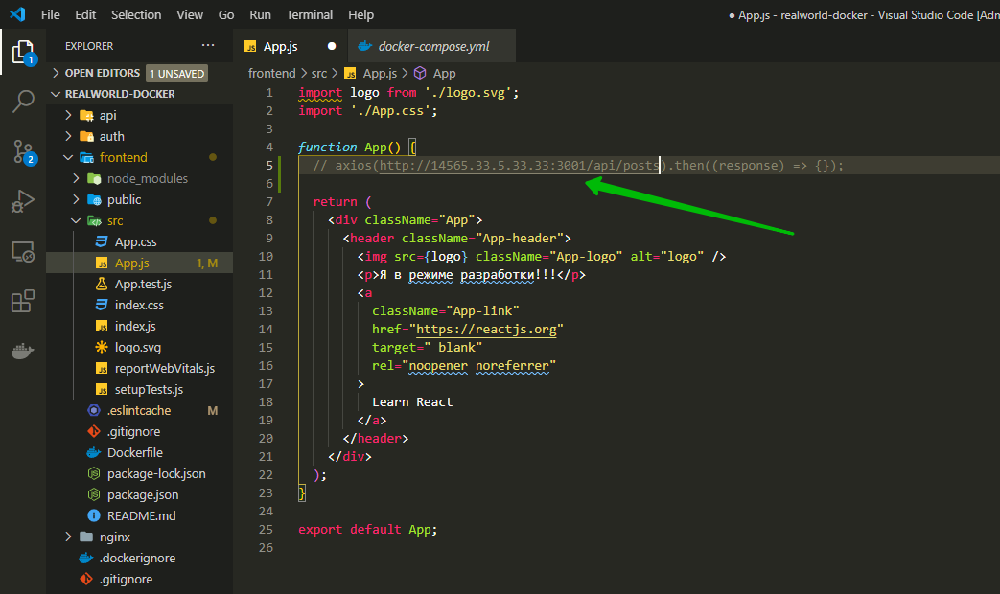

т.е. мы обращаемся на наш public api и забираем там данные.

Какие же проблемы в этом подходе. первая проблема это в том что у нас сейчас домен realworld-docker.com а это у нас api адрес http://14565.33.5.33.33:3001/api/posts. По факту для браузера это другой домен. И как известно у нас в браузере есть огромное количество ограничений, например крос доменные запросы и как их правильно делать т.е. грубо говоря у нас есть куча ограничений браузера которых у нас небыло когда мы делали запросы между двумя backend, поскольку там нет браузера и из-за этого все проще.

Первый вариант это выставить expose публично api, он будет всем доступен, и мы будем обращаться по порту и по какому-то api адресу т.е. нам не обязательно будет покупать домен для этого api поскольку человек все равно этого не видит и запрос у нас происходит по порту. Это не очень хороший подход потому что с крос доменными запросами всегда будут проблемы.

Лучший подход это использование nginx. как это выглядит. Это значит что у нас есть домен realworld-docker.com. И у нас уже настроен наш nginx что бфы каким-то образом разруливать наши запросы.

Здесь мы все запросы посылаем на

```nginx
server {
  listen 80;

  server_name realworld-docker.com;

  location / {
    proxy_pass http://frontend:3000;
  }
}
```

Это файл nginx/nginx.conf.prod. Мы можем сюда добавить новый location который будет разруливать /api либо /auth/api. Соответсвенно nginx менеджит абсолютно все.

И это означает что в App.js мы можем обращаться на url

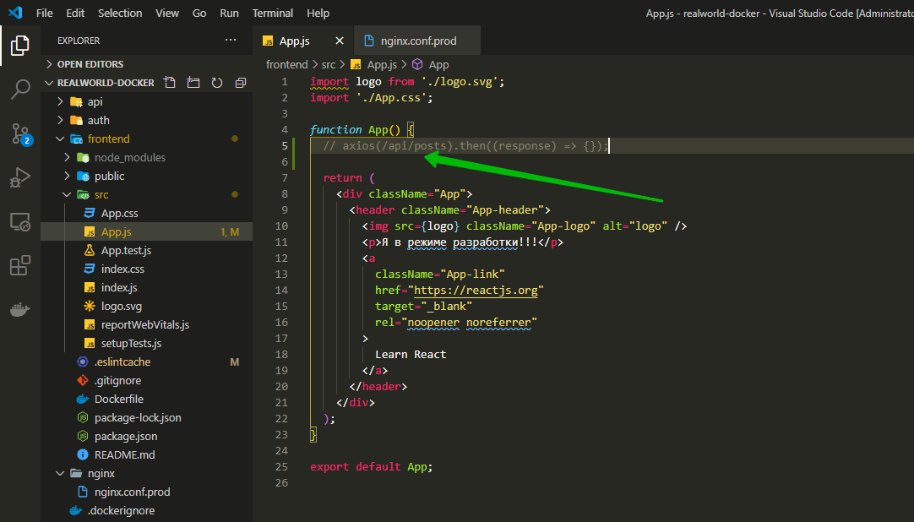

И это еще одна хорошая вещь.

Как вы помните в двух других сервисах мы использовали переменные окружения.

Что же происходит на frontend. Опять же вы можете подумать что на frontend достаточно написать переменные окружения и они будут доступны в нашем frontend.

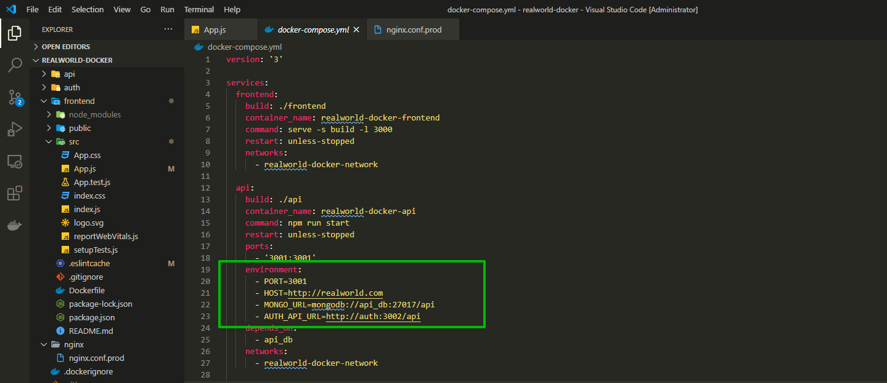

На самом деле нет. Потому что все эти переменные окружения попадают в backend, это значит что они все попадают в сервер. В нашем случае это в react app и в node которые будут buid наш frontend. Это значит что нам нужно каким-тодополнительным образом передать эти переменные окружения из backend в наш собранный js. А это дополнительные трудности.

Зачем нам дополнительные трудности ест=ли мы можем обойтись в нашем frontend без переменных окружения и просто делать запрос на

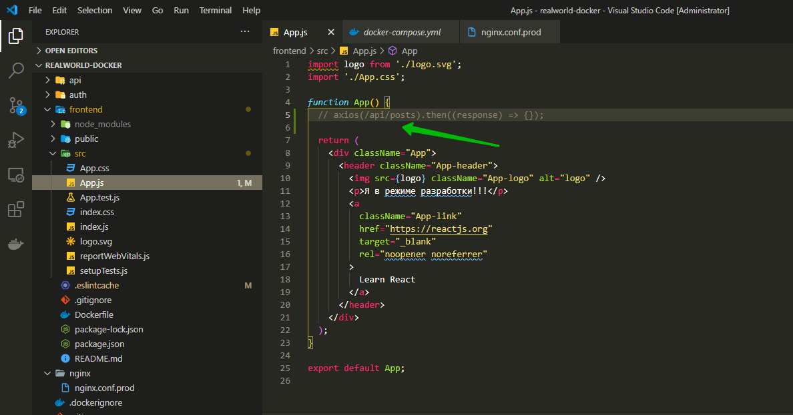

Про крос доменные операции можно почитать про cors [https://developer.mozilla.org/ru/docs/Web/HTTP/CORS](https://developer.mozilla.org/ru/docs/Web/HTTP/CORS).

И вкраце лучше их не делать.

Первое что нужно сделать это в nginx.conf.prod добавить новый location. Копирую существующий и прописываю /api. Это значит что все запросы начинающиеся со /api попадают в эту секцию. И здесь я хочу все запросы перебросить на хост api:3001;

Но теперь один хитрый момент. Когда мы пишем вот так вот например

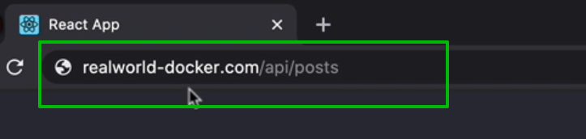

то тогда этот запрос так и попадает в наш api/src/index.js \вот сюда

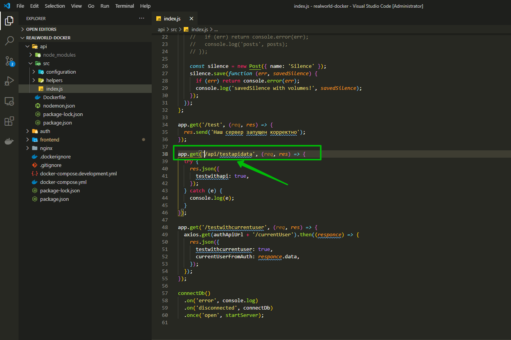

И здесь мы должны описать /api/posts/.

Но мне это не очень нравиться поскольку для меня этот сервис стабильный. т.е. нет никакого смысла делать /api/posts/.

Что бы этого избежать я могу в nginx.conf.prod я могу добавить правило rewrite. Оно означает что мы хотим перезаписать url. И теперь здесь нужно написать регулярное выражение.

```nginx
server {
  listen 80;

  server_name realworld-docker.com;

  location / {
    proxy_pass http://frontend:3000;
  }
  location /api {
    proxy_pass http://api:3001;
    rewrite ^/api/(.*) /$1 break;
  }
}
```

Т.е. перезаписываю и указываю что идет после /api/ я тоже буду использовать. И вот таким образом у нас наш запрос попадет в наш api. т.е. /api/ удаляется, а все что после него остается.

Точно так же я хочу обработать наш сервис авторизации.

```nginx
server {
  listen 80;

  server_name realworld-docker.com;

  location / {
    proxy_pass http://frontend:3000;
  }
  location /api {
    proxy_pass http://api:3001;
    rewrite ^/api/(.*) /$1 break;
  }
  location /auth/api {
    proxy_pass http://auth:3002;
    rewrite ^/auth/api/(.*) /$1 break;
  }
}
```

Для того что бы все прошло успешно нужно в папке frontend

```shell
npm install axios
```

Поскольку это у нас отдельный проект.

После чего создаю новую кнопку которая будет делать запрос например на наш api. <button onclick={makeApiRequest}>Делаю запрос на api</button>. И в верху файла создаю данную функцию.

```js
// frontend/src/App.js
import logo from './logo.svg';
import './App.css';

function App() {
  // axios(/api/posts).then((response) => {});
  const makeApiRequest = () => {
    console.log('makeApiRequest');
  };

  return (
    <div className="App">
      <header className="App-header">
        
        <p>Я в режиме разработки!!!</p>
        <a
          className="App-link"
          href="https://reactjs.org"
          target="_blank"
          rel="noopener noreferrer"
        >
          Learn React
        </a>
        <button onClick={makeApiRequest}>Делаю запрос на api</button>
      </header>
    </div>
  );
}

export default App;
```

Пересобираю проект и смотрю.

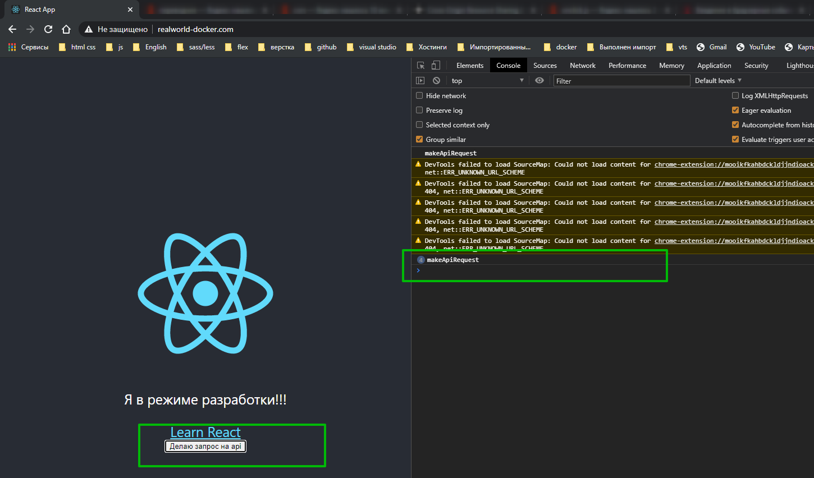

И теперь если я перехожу по **realworl-docker.com/api/testwithcurrentuser**
