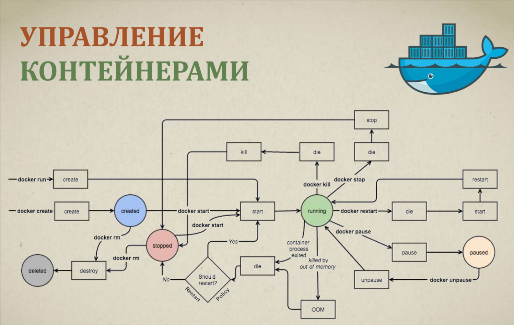
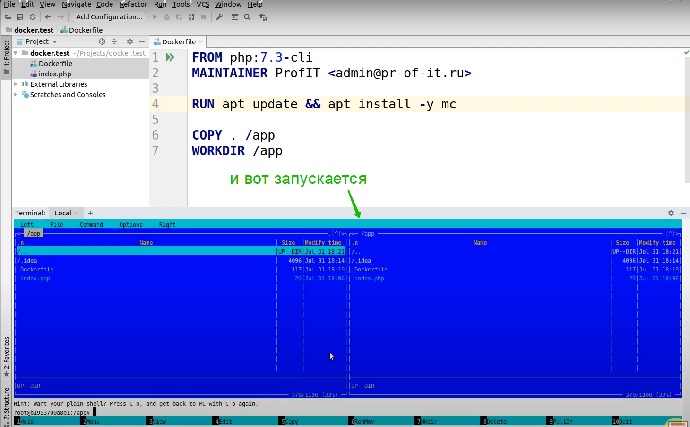

# Docker: как начать и что он даст простому веб-разработчику?

<br>
<br>

[https://www.youtube.com/watch?v=p6Qwf6d8EKs&feature=youtu.be](https://www.youtube.com/watch?v=p6Qwf6d8EKs&feature=youtu.be)

<br>
<br>

```shell
docker run -it nginx bash
```

- **docker run** - создание и запуск контейнера
- **-it** - Опции, говорящие о том, что мы хотим интерактивно взаимодействовать с контейнером (оказаться «внутри» него).
- **nginx** - Имя образа контейнера. Образ будет скачан из хранилища образов [Docker Hub](https://hub.docker.com/). Образ, по сути - самостоятельная файловая система.
- **bash** - команда которая должна быть выполнена в запущенном контейнере.

Контейнер можно рассматривать, как **процесс** в изолированном **окружении** с собственной **файловой системой**.

- **docker images** - просмотр зарегистрированных образов.

Рассмотрим более подробно команду

```shell
docker run -it nginx bash
```


Нам Docker заявил что локально такого образа нет **Unable to find image 'nginx:latest' locally**. Далее он его вытаскивает из **latest:Pulling from library/nginx**. Далее в **Digest** вытащил его цифровую подпись. И далее идет статус **status: Downloaded newer image for nginx:latest** после чего происходит запус контейнера.

Что бы выйти из данного созданного образа

```shell
exit
```

Теперь если посмотреть

```shell
docker images
```

То мы теперь увидим что данный образ скачен в локальный реестр.


Мы можем запустить контейнер не в интерактивном режиме и выполнить например команду.

```shell
docker run nginx cat /etc/nginx/nginx.conf
```

- **docker run** - создание и запуск контейнера
- **nginx** - Имя образа контейнера
- **cat** - Команда, которая должна быть выполнена в запущенном контейнере. При этом интерактивности нет, команда выполняется и все.

На основе образа создается контейнер, запускается, в нем выполняется эта команда. Выполняется команда и работа прекращается.

Для того что бы взаимодействовать с контейнером нужно указать на каком порту запусткать контейнер и через какой порт мы будем взаимодействовать с этим контейнером.

```shell
docker run -p 8080:80 nginx
```

Теперь я могу в браузере зайти на localhost:8080


```shell
docker run -p 8080:80 nginx
```

- **docker run** - создание и запуск контейнера
- **-p 8080:80** - Проброс порта. Порт 80 «изнутри» контейнера становится портом **0.0.0.0:8080**
- Кроме того происходит запуск команды запуска, прописанной в самом контейнере - это , собственно, старт nginx.

_NB: флаг_ **-d** _запустит команду в фоне_

```shell
docker run -p 8080:80 -d nginx
```


Есть команда

```shell
docker ps
```

Она показывает исполняющиеся процессы в контейнерах.

```shell
docker ps -a
```

Флаг **-a** показывает все контейнеры которые когда либо создавались.

Маленький итог:

- Контейнер - это процесс
- Docker - запускает этот процесс в изолированном окружении:
- Своя сеть
- Свой список процессов
- Своя файловая система

<br>
<br>

- Образ - это отдельная виртуальная файловая система, которая подключается к контейнеру и процесс работает с ней.

```shell
docker images
```

Просмотр уже скаченных образов Docker.

```shell
docker rmi nginx:latest
```

- удаление образа (разумеется если нет контейнеров на его базе!)

## Прассмотрим теги

Рассмортим команду

```shell
docker run -it php:7.1-cli
```

Все что идет после двоеточия это есть тег.


И мы сразу попадаем в оболочку php где можно сразу начать что-то писать.
Теги нужны что бы указать какую-то версию.



Цветными кружочками выделены состояния контейнеров.

- created - созданный. Т.е. если вы в место команды docker run используйте create. Контейнер будет создан и собран, но при этом не запущен.
- running - это работающий контейнер.
- paused - контейнер можно поставить на паузу.
- docker unpause - снятие с паузы.
- stopped - остановка контейнера т.е. команды docker die, docker kill, docker stop и т.д.
- deleted - команда docker rm удаляет контейнер.

Очень хорошая схема т.к. в ней представлены все основные команды.

Мы довольно часто используем id контейнера.


Так же и останавливаю контейнер


Если я введу команду

```shell
docker ps
```

то данного контейнера я не увижу. Но если с флагом -a

```shell
docker ps -a
```

он покажет что данный контейнер существует и у него статус created


т.е. он просто создан и аккуратно остановлен. ps -a т.е. ps all покажи мне все контейнеры.

Запуск контейнера.


Вот такие простые команды есть для перехода между статусами контейнера.

<br>
<br>

## Управление контейнерами

```shell
docker ps
```

- список запущенных контейнеров.
- **-a** - вывод всех контейнеров, включая остановленные (успешно или с ошибкой)

```shell
docker starts
```

- информация о потреблении ресурсов

```shell
docker logs ID
```

- вывод логов из указанного контейнера
- **-f** вывод логов в стиле **tail -f**

```shell
docker kill ID
```

- принудительная остановка указанного контейнера

Кроме того: **stop**, **pause**, **unpause**, **restart**.

<br>
<br>

Рассмотрим очень полезную команду

```shell
docker logs ID
```

Допустим когда мы запускаем контейнер в фоне **docker run -p 8080:80 -d nginx**


Т.к. я перезапустил контейнер у него теперь будет другой ID. Потому что образ тот же самый а контейнер другой.

Когда он запускается в фоне мы не видим логов.

Для того что бы прочесть логи из контейнера

```shell
docker logs ID
```


Однако данную команду нужно вводить после каждого обновления страницы в браузуре.

Для того что бы логи отслеживались и выводились в консоль автоматически для этого нужно использовать флаг **-f**

```shell
docker logs -f ID
```

Команда

```shell
docker starts
```

Данная команда показывает какие ресурсы потребляются


Она показывает по каждому контейнеру сколько контейнер сейчас потребляет памяти, каков обмен по сети и каков обмен с диском собственно.

<br>
<br>
<br>

## Что такое Docker Hub?

Это крупнейшая в мире библиотека образов контейнеров и registry (реестр) по умолчанию.

Найти ее можно по адресу [https://hub.docker.com/](https://hub.docker.com/).

- Публичный репозиторий образов
- Официальные образы | от производителя софта
- Семантическое версионирование
- Сертифицированные образы

```shell
docker pull nginx
```

- Скачиваем образ из официального **registry: Docker Hub** в свое локальное хранилище

```shell
docker pull myreq:port/my/nginx
```

- Качаем образ **my/nginx** из **registry** по адресу **myreq:port**.

<br>
<br>
<br>

## Взаимодействие контейнера с внешним миром.

```shell
docker run -p 80:80 -p 443:443 nginx
```

- Проброс портов. Указываем внешний порт (на хост машине) и внутренний (внутри контейнера). В результате контейнер становится доступен по сети.

```shell
docker run -v ~/project:/app nginx
```

- Проброс папки (или файла) из ФС хост машины в контейнер
- Путь в ФС должен быть абсолютным
- Если папка (файл) ранее существовали в контейнере - будут заменены

```shell
docker run -e "HOME=/app" nginx
```

```shell
docker run --env-file=.env nginx
```

- Запуск контейнера с установкой переменных окружения.


Теперь я могу пробросить файлы. К примеру пробрасываю весь проект в папку app

```shell
docker run -p 8080:80 -v ~/Projects/docker.test:/app nginx
```

Если папки app внутри контейнера файловой системы не будет, то она создасться.

Далее нужно попасть внутрь контейнера

```shell
docker exec -it ID bash
```


<br>
<br>

## Подготовка собственного образа

Для начало нужно подготовить специальный файл, который называется Dockerfile:

```Dockerfile
FROM nginx:lastet
MAINTAINER ProFIT <admin@pr-of-it>
RUN apt-get update
COPY . /app
WORKDIR /app
```

- Обязательно указываем образ от которого наследуемся
- RUN - выполняет определенные нами команды при сборке образа (создает слой)
- COPY - Копирует указанные папки или файлы внутрь образа
- WORKDIR - Установка стартовой директории для процесса

```shell
docker build .
```

- Собирает контейнер и помещает его в registry

Деректива FROM говорит о том какой образ взять за основу.

```Dockerfile
FROM php:7.3-cli
```

MAINTAINER здесь мы можем гордо указать себя в качестве разработчика этого образа.

WORKDIR это рабочая директория внутри нашего контейнера.

```Dockerfile
FROM php:7.3-cli
MAINTAINER ....
WORKDIR /app
```

Мы при сборке образа можем указать что из текущей папки мы хотим скопировать в папку app контейнера.

```Dockerfile
FROM php:7.3-cli
MAINTAINER ....
COPY . /app
WORKDIR /app
```

Так же мы можем выполнить команду RUN которая создаст новый слой. Каждый контейнер можно представить как некие слои. Слои это коммиты как в GIT. Команда RUN по верх существующих слоев строит еще один

```Dockerfile
FROM php:7.3-cli
MAINTAINER ....

RUN apt update && apt install composer

COPY . /app
WORKDIR /app
```

После установки composer создастся еще один слой который будет отличаться от FROM php:7.3-cli тем что в нем присутствует composer.

На самом деле у нас храняться образы ввиде этих слоев.

после чего я могу собрать контейнер с помощью команды в терминале.

```shell
docker build .
```

Composer у него так и не установился.

Для того что бы все прошло успешно нужно добавить флаг **-y** т.е. дать на все устанавливаемое согласие по умолчанию.

```Dockerfile
FROM php:7.3-cli
MAINTAINER ....

RUN apt update && apt install -y composer

COPY . /app
WORKDIR /app
```




Обычно нужно запускать несколько контейнеров одновременно.

- Описываем конфигурацию контейнеров для нашего проекта в файле **docker-compose.yaml**
- Собираем проект используя команду

```shell
docker-compose -up --build -d
```

Убеждаемся что нужные нам контейнеры созданы и запущены.

В **docker-compose.yaml** первым указываю версию с которой я буду работать **version: '3'**. После указываю services: это как раз таки то где указывается список контейнеров для запуска.
Каждый из них именуется services. Указываю nginx: А в build: указываю инструкции по его сборке.
Мы скажем что иди в папку ./docker/nginx там для тебя лежит Dokerfile

```yaml
version: '3'

services:
  nginx:
  build: ./docker/nginx
```

Далее необходимо прокинуть порты

```yaml
version: '3'

services:
  nginx:
  build: ./docker/nginx
  ports:
    - '8080:80'
```

Далее идет **volumes:** т.е. тома это собственно говоря мапинг файл. Здесь мы говорим что все должно проецироваться в папку app контейнера.

```yaml
version: '3'

services:
  nginx:
  build: ./docker/nginx
  ports:
    - '8080:80'
  volumes:
    - ./:/app
```

Запускается это все с помощью команды

```shell
docker-compose app --build -d
```

И смотрю создался ли контейнер

```shell
docker ps
```


